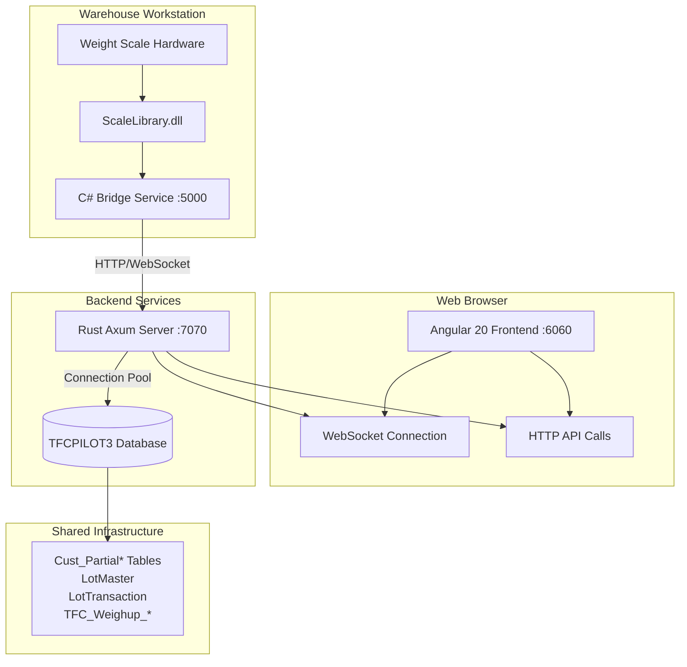
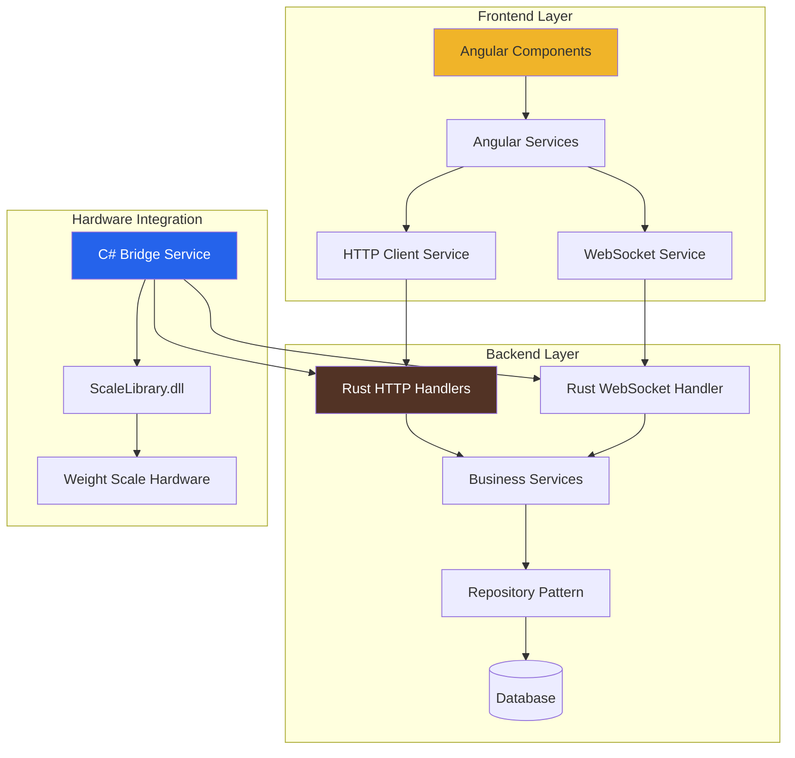
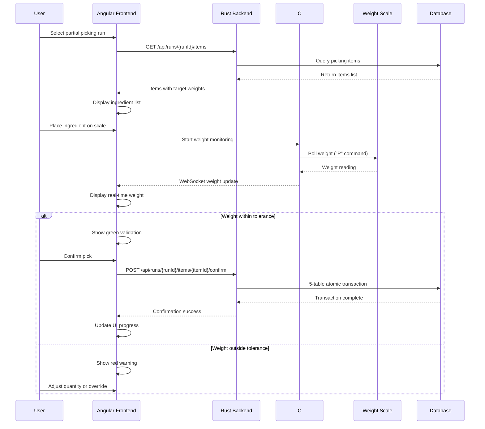
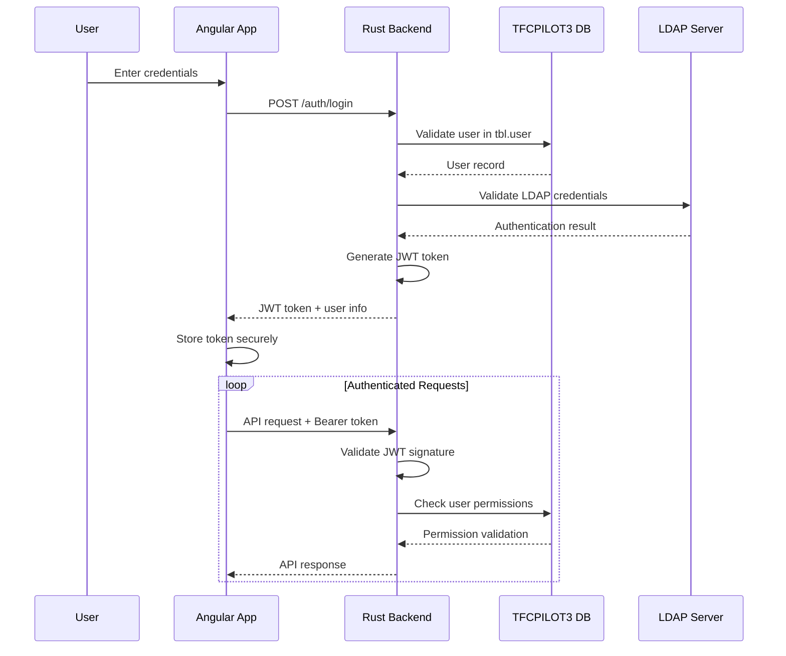
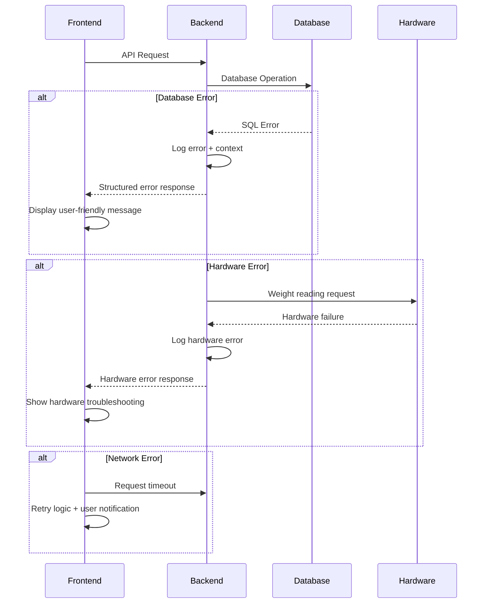

# PK (Partial Picking System) Fullstack Architecture Document

## Introduction

This document outlines the complete fullstack architecture for **PK (Partial Picking System)**, including backend systems, frontend implementation, and their integration. It serves as the single source of truth for AI-driven development, ensuring consistency across the entire technology stack.

This unified approach combines what would traditionally be separate backend and frontend architecture documents, streamlining the development process for modern fullstack applications where these concerns are increasingly intertwined.

The PK system modernizes the legacy PartialPickingInKG.exe application into a comprehensive web-based solution that integrates Angular 20 frontend, Rust backend services, and C# bridge services for weight scale hardware communication. The architecture leverages proven patterns from the existing Mobile-Rust implementation while maintaining complete operational independence in the `/PK/` application folder.

### Starter Template Analysis

**Status:** N/A - Greenfield project

**However, there are important architectural inheritances:**
- **Mobile-Rust Pattern Reference**: The system follows proven Angular + Rust + SQL Server patterns from the existing Mobile-Rust bulk picking system, but implements everything from scratch
- **Existing Infrastructure**: Leverages existing ScaleLibrary.dll, TFCPILOT3 database, and workstation configurations
- **Standalone Implementation**: Complete independence in `/PK/` folder with no code dependencies on existing systems

### Change Log

| Date | Version | Description | Author |
|------|---------|-------------|---------|
| 2025-09-24 | 1.0 | Initial fullstack architecture document creation | Winston (Architect) |

## High Level Architecture

### Technical Summary

The PK (Partial Picking) system implements a modern three-tier fullstack architecture combining Angular 20 frontend with real-time WebSocket capabilities, Rust backend services for high-performance business logic and database operations, and a specialized C# bridge service for hardware integration. The architecture prioritizes real-time weight scale communication (≤100ms response times), concurrent multi-user operations across 10+ workstations, and seamless integration with existing TFCPILOT3 database infrastructure. The system leverages proven patterns from Mobile-Rust while maintaining complete operational independence, utilizing WebSocket connections for live weight updates, Axum framework for performant API services, and ScaleLibrary.dll through the C# bridge for reliable hardware compatibility.

### Platform and Infrastructure Choice

**Platform:** On-Premises + Cloud Hybrid
**Key Services:** IIS/Nginx frontend hosting, Rust Axum backend, C# bridge service, TFCPILOT3 SQL Server, optional cloud monitoring
**Deployment Host and Regions:** On-premises warehouse network with cloud monitoring endpoints

### Repository Structure

**Structure:** Monorepo with clear service boundaries
**Monorepo Tool:** npm workspaces
**Package Organization:** Service-oriented with shared libraries

### High Level Architecture Diagram



### Architectural Patterns

- **Microservices Architecture:** Separate concerns between frontend (Angular), business logic (Rust), and hardware integration (C#) - *Rationale:* Enables independent scaling, technology optimization per service, and hardware isolation

- **Real-Time Event-Driven Architecture:** WebSocket connections for live weight updates and user interface synchronization - *Rationale:* Critical for ≤100ms weight reading requirements and multi-user coordination

- **Repository Pattern:** Abstract database access through Rust repository layer with connection pooling - *Rationale:* Enables testability, database migration flexibility, and performance optimization

- **Bridge Pattern:** C# service abstracts hardware communication complexity from main application - *Rationale:* Leverages existing ScaleLibrary.dll without forcing C# throughout the stack

- **Component-Based UI:** Angular standalone components with TypeScript and shadcn/ui - *Rationale:* Maintainability, reusability, and consistent NWFTH branding across the application

## Tech Stack

### Technology Stack Table

| Category | Technology | Version | Purpose | Rationale |
|----------|------------|---------|---------|-----------|
| Frontend Language | TypeScript | 5.3+ | Type-safe frontend development | Enhanced developer experience and error prevention |
| Frontend Framework | Angular | 20.x | Modern reactive web application | Proven performance, enterprise support, strong ecosystem |
| UI Component Library | shadcn/ui | Latest | NWFTH brown-themed components | Customizable, accessible, matches Mobile-Rust design system |
| State Management | Angular Signals | Built-in | Reactive state management | Native Angular solution, optimal performance |
| Backend Language | Rust | 1.75+ | High-performance backend services | Memory safety, concurrency, zero-cost abstractions |
| Backend Framework | Axum | 0.7+ | Web framework for Rust | Tokio-based async, excellent WebSocket support |
| API Style | REST + WebSocket | HTTP/1.1 | RESTful APIs with real-time updates | Standard patterns with real-time capabilities |
| Database | SQL Server | 2019+ | TFCPILOT3 existing infrastructure | Leverage existing investment and expertise |
| Cache | In-Memory | Built-in | Application-level caching | Simple, effective for workstation configurations |
| File Storage | Local + Optional Cloud | N/A | Configuration and optional backup | On-premises primary with cloud backup option |
| Authentication | SQL Server + LDAP | Existing | User authentication and authorization | Integrate with existing identity infrastructure |
| Frontend Testing | Jest + Testing Library | Latest | Unit and integration testing | Industry standard Angular testing tools |
| Backend Testing | Rust built-in | Built-in | Unit and integration testing | Native Rust testing framework |
| E2E Testing | Playwright | Latest | End-to-end workflow testing | Reliable, modern E2E testing solution |
| Build Tool | Angular CLI + Cargo | Latest | Framework-native build tools | Optimized tooling for each technology |
| Bundler | Webpack (via Angular CLI) | Latest | Frontend asset bundling | Integrated Angular build pipeline |
| IaC Tool | PowerShell Scripts | Built-in | Windows deployment automation | Windows-native deployment scripting |
| CI/CD | GitHub Actions | Latest | Automated testing and deployment | Cloud-native CI/CD with Windows support |
| Monitoring | Application Insights | Optional | Performance and error monitoring | Optional cloud monitoring integration |
| Logging | Structured Logging | Built-in | Application logging and debugging | Native logging frameworks per technology |
| CSS Framework | Tailwind CSS | v4 | NWFTH brown theme utility-first styling | Efficient styling with Mobile-Rust color palette |

## NWFTH Brown Theme Integration

**Design System**: Complete integration of Mobile-Rust brown color palette and component styling patterns for consistent NWFTH branding across the partial picking interface.

### Color Palette (Mobile-Rust Compatible)

**Primary Brand Colors:**
```css
--color-brand-brown: #523325;      /* Dark Coffee Brown - Primary brand color */
--color-brand-amber: #F0B429;      /* Golden Amber - Accent and highlight color */
--color-brand-cream: #F5F5DC;      /* Soft Cream - Light background and text */
```

**Extended Design System Colors:**
```css
/* HSL Format for Tailwind v4 Compatibility */
--color-brand-brown: 20 50% 25%;        /* #523325 - Dark Coffee Brown */
--color-brand-amber: 43 87% 56%;        /* #F0B429 - Golden Amber */
--color-brand-cream: 60 56% 91%;        /* #F5F5DC - Soft Cream */

/* Design System Semantic Colors */
--color-background: 0 0% 100%;          /* Pure white backgrounds */
--color-foreground: 25 65% 15%;         /* Dark brown text */
--color-muted: 60 30% 97%;              /* Light cream muted areas */
--color-muted-foreground: 25 40% 35%;   /* Medium brown secondary text */
--color-border: 25 20% 85%;             /* Warm border colors */
--color-accent: var(--color-brand-amber);
--color-primary: var(--color-brand-brown);
```

### Tailwind Configuration

**Complete Tailwind v4 Config (Mobile-Rust Pattern):**
```javascript
/** @type {import('tailwindcss').Config} */
module.exports = {
  content: [
    "./src/**/*.{html,ts}",
    "./src/**/*.component.html",
    "./src/**/*.component.ts"
  ],
  prefix: 'tw-',
  theme: {
    extend: {
      colors: {
        'brand-brown': '#523325',
        'brand-amber': '#F0B429',
        'brand-cream': '#F5F5DC',
        background: 'hsl(var(--color-background))',
        foreground: 'hsl(var(--color-foreground))',
        muted: 'hsl(var(--color-muted))',
        'muted-foreground': 'hsl(var(--color-muted-foreground))',
        border: 'hsl(var(--color-border))',
        accent: 'hsl(var(--color-accent))',
        primary: 'hsl(var(--color-primary))',
      },
      borderRadius: {
        DEFAULT: 'var(--radius)',
      },
      boxShadow: {
        soft: 'var(--shadow-soft)',
        medium: 'var(--shadow-medium)',
        large: 'var(--shadow-large)',
      },
    },
  },
  plugins: [],
}
```

### NWFTH Component Classes

**Form Components:**
```css
/* NWFTH Card Component */
.nwfth-card {
  background-color: hsl(var(--color-background));
  border-radius: var(--radius);
  border: 1px solid hsl(var(--color-border));
  box-shadow: var(--shadow-soft);
  transition: all 0.2s ease-in-out;
}

/* NWFTH Input Fields */
.nwfth-input {
  background-color: hsl(var(--color-background));
  border: 1px solid hsl(var(--color-border));
  border-radius: var(--radius);
  color: hsl(var(--color-foreground));
  transition: all 0.2s ease-in-out;
}

.nwfth-input:focus-visible {
  outline: none;
  border-color: hsl(var(--color-brand-amber));
  box-shadow: 0 0 0 2px hsl(var(--color-brand-amber) / 0.2);
}

.nwfth-input:read-only {
  background-color: hsl(var(--color-muted));
  color: hsl(var(--color-muted-foreground));
  cursor: not-allowed;
}
```

**Button Components:**
```css
/* Primary Brown Button */
.nwfth-button-primary {
  background-color: hsl(var(--color-brand-brown));
  color: hsl(var(--color-brand-cream));
  border-radius: var(--radius);
  font-weight: 600;
  transition: all 0.2s ease-in-out;
}

.nwfth-button-primary:hover:not(:disabled) {
  background-color: hsl(var(--color-brand-brown) / 0.9);
  transform: translateY(-1px);
  box-shadow: var(--shadow-medium);
}

/* Secondary Amber Button */
.nwfth-button-secondary {
  background-color: hsl(var(--color-muted));
  color: hsl(var(--color-foreground));
  border: 1px solid hsl(var(--color-border));
  border-radius: var(--radius);
  font-weight: 500;
  transition: all 0.2s ease-in-out;
}

.nwfth-button-secondary:hover:not(:disabled) {
  background-color: hsl(var(--color-brand-amber));
  color: hsl(var(--color-foreground));
  border-color: hsl(var(--color-brand-amber));
}
```

**Data Grid Styling:**
```css
/* NWFTH Data Table */
.nwfth-data-grid {
  border: 1px solid hsl(var(--color-border));
  border-radius: var(--radius);
  overflow: hidden;
}

.nwfth-data-grid thead {
  background-color: hsl(var(--color-brand-brown));
  color: hsl(var(--color-brand-cream));
}

.nwfth-data-grid tbody tr {
  border-bottom: 1px solid hsl(var(--color-border));
  transition: background-color 0.2s ease-in-out;
}

.nwfth-data-grid tbody tr:hover {
  background-color: hsl(var(--color-brand-cream) / 0.3);
}

.nwfth-data-grid th,
.nwfth-data-grid td {
  padding: 8px 12px;
  text-align: left;
  font-size: 0.875rem;
}
```

### Interface-Specific Styling

**Desktop Layout Classes:**
```css
/* Main Interface Container */
.picking-main-container {
  min-height: 100vh;
  background-color: hsl(var(--color-brand-cream));
  padding: 1rem;
}

/* Form Window Container */
.picking-form-window {
  max-width: 112rem; /* 7xl */
  margin: 0 auto;
  padding: 1.5rem;
  background-color: white;
  border-radius: var(--radius);
  box-shadow: var(--shadow-large);
}

/* Weight Display Panel */
.picking-weight-display {
  border: 1px solid hsl(var(--color-brand-brown) / 0.3);
  border-radius: var(--radius);
  padding: 0.75rem;
  background-color: hsl(var(--color-brand-cream) / 0.3);
}

.picking-weight-value {
  font-size: 1.125rem;
  font-family: ui-monospace, monospace;
  color: hsl(var(--color-brand-brown));
  font-weight: 600;
}

/* Status Indicators */
.status-intermediate {
  display: inline-block;
  padding: 0.25rem 1rem;
  background-color: hsl(var(--color-brand-amber));
  color: hsl(var(--color-brand-brown));
  border-radius: 9999px;
  font-size: 0.875rem;
  font-weight: 600;
}
```

### Responsive Design Specifications

**Design Philosophy**: Maintain the exact desktop interface proportions and layout across different screen sizes while ensuring usability on warehouse workstation displays. The responsive design preserves the desktop workflow without compromising functionality.

#### Warehouse Workstation Breakpoints
```css
/* Ultra-Wide Workstation Displays (2560x1440+) */
@media (min-width: 2560px) {
  .picking-form-window {
    max-width: 140rem; /* Extra wide for large monitors */
    padding: 2.5rem;
    font-size: 1.125rem; /* Slightly larger text for readability */
  }

  /* Scale up form elements proportionally */
  .nwfth-input,
  .nwfth-button-primary,
  .nwfth-button-secondary {
    font-size: 1.125rem;
    padding: 1rem 1.25rem;
    border-width: 2px;
  }

  /* Larger data grid for better visibility */
  .nwfth-data-grid th,
  .nwfth-data-grid td {
    padding: 12px 16px;
    font-size: 1rem;
  }

  /* Enhanced weight display */
  .picking-weight-value {
    font-size: 1.5rem;
  }
}

/* Large Workstation Displays (1920x1080+) - Primary Target */
@media (min-width: 1920px) and (max-width: 2559px) {
  .picking-form-window {
    max-width: 120rem;
    padding: 2rem;
  }

  /* Desktop-optimal sizing */
  .nwfth-input,
  .nwfth-button-primary,
  .nwfth-button-secondary {
    font-size: 1rem;
    padding: 0.75rem 1rem;
  }

  /* Maintain exact desktop grid proportions */
  .tw-grid-cols-12 {
    display: grid;
    grid-template-columns: repeat(12, minmax(0, 1fr));
    gap: 1.5rem;
  }

  /* Preserve desktop data grid appearance */
  .nwfth-data-grid {
    min-height: 300px; /* Ensure sufficient height for data visibility */
  }

  .nwfth-data-grid th,
  .nwfth-data-grid td {
    padding: 10px 14px;
    font-size: 0.875rem;
  }

  /* Desktop weight panel proportions */
  .picking-weight-value {
    font-size: 1.25rem;
  }
}

/* Medium Workstation Displays (1366x768, 1600x900) */
@media (min-width: 1366px) and (max-width: 1919px) {
  .picking-form-window {
    max-width: 96rem;
    padding: 1.5rem;
  }

  /* Maintain desktop layout but slightly compressed */
  .tw-grid-cols-12 {
    display: grid;
    grid-template-columns: repeat(12, minmax(0, 1fr));
    gap: 1rem;
  }

  /* Compress weight panel slightly */
  .tw-grid-cols-3 {
    gap: 0.75rem;
  }

  /* Adjust font sizes for medium displays */
  .nwfth-input,
  .nwfth-button-primary,
  .nwfth-button-secondary {
    font-size: 0.875rem;
    padding: 0.625rem 0.875rem;
  }

  .picking-weight-value {
    font-size: 1.125rem;
  }

  .nwfth-data-grid th,
  .nwfth-data-grid td {
    padding: 8px 12px;
    font-size: 0.8125rem;
  }
}

/* Small Workstation Displays (1024x768) - Minimum Warehouse Standard */
@media (min-width: 1024px) and (max-width: 1365px) {
  .picking-form-window {
    max-width: 80rem;
    padding: 1.25rem;
    margin: 0.5rem auto;
  }

  /* Maintain desktop layout but more compressed */
  .tw-grid-cols-12 {
    display: grid;
    grid-template-columns: repeat(12, minmax(0, 1fr));
    gap: 0.75rem;
  }

  /* Compact weight controls */
  .tw-grid-cols-3 {
    gap: 0.5rem;
  }

  /* Smaller but readable elements */
  .nwfth-input,
  .nwfth-button-primary,
  .nwfth-button-secondary {
    font-size: 0.8125rem;
    padding: 0.5rem 0.75rem;
  }

  .picking-weight-value {
    font-size: 1rem;
  }

  .nwfth-data-grid th,
  .nwfth-data-grid td {
    padding: 6px 10px;
    font-size: 0.75rem;
  }

  /* Ensure action buttons remain usable */
  .tw-flex.tw-space-x-3 {
    gap: 0.5rem;
  }
}

/* Tablet/Mobile Fallback (768px and below) - Emergency Access Only */
@media (max-width: 1023px) {
  .picking-form-window {
    margin: 0.25rem;
    padding: 0.75rem;
    max-width: 100%;
  }

  /* Stack layout for small screens */
  .tw-grid-cols-12 {
    display: block;
  }

  .tw-col-span-6,
  .tw-col-span-4,
  .tw-col-span-8 {
    width: 100%;
    margin-bottom: 1rem;
  }

  /* Stack weight controls */
  .tw-grid-cols-3 {
    display: block;
  }

  .tw-grid-cols-3 > div {
    margin-bottom: 0.75rem;
  }

  /* Mobile-friendly buttons */
  .nwfth-button-primary,
  .nwfth-button-secondary {
    width: 100%;
    margin-bottom: 0.5rem;
    padding: 0.75rem;
    font-size: 1rem;
  }

  /* Scrollable data grid */
  .nwfth-data-grid {
    overflow-x: auto;
    white-space: nowrap;
  }

  .nwfth-data-grid table {
    min-width: 600px;
  }

  /* Warning message for mobile users */
  .mobile-warning {
    display: block;
    background-color: hsl(var(--color-brand-amber));
    color: hsl(var(--color-brand-brown));
    padding: 0.75rem;
    border-radius: var(--radius);
    margin-bottom: 1rem;
    text-align: center;
    font-size: 0.875rem;
  }
}

/* Hide mobile warning on desktop */
@media (min-width: 1024px) {
  .mobile-warning {
    display: none;
  }
}
```

#### Layout Preservation Strategy

**Desktop-First Approach:**
- **Primary Target**: 1920x1080 workstation displays (most common warehouse setup)
- **Grid System**: 12-column CSS Grid maintains exact desktop proportions
- **Component Scaling**: Elements scale proportionally rather than breaking layout
- **Functional Priority**: All desktop functionality preserved across screen sizes

**Layout Breakpoint Strategy:**
```typescript
interface ResponsiveConfig {
  breakpoints: {
    ultraWide: '2560px+';    // Large monitors, enhanced visibility
    desktop: '1920px';       // Primary target, exact desktop replication
    medium: '1366px';        // Common warehouse displays, slight compression
    small: '1024px';         // Minimum warehouse standard, compact layout
    mobile: '768px';         // Emergency access only, warning displayed
  };

  layoutBehavior: {
    preserveDesktopGrid: true;           // Maintain 12-column structure
    maintainProportions: true;          // Scale rather than reflow
    prioritizeFunctionality: true;      // Keep all desktop features
    showMobileWarning: true;            // Alert for non-optimal screens
  };
}
```

**Component Responsive Behavior:**
```css
/* Form Header - Always horizontal layout */
.picking-header-panel {
  display: grid;
  grid-template-columns: 1fr 1fr;
  gap: clamp(0.5rem, 2vw, 2rem);
}

/* Weight Panel - Maintains 3-column structure */
.picking-weight-panel .tw-grid-cols-3 {
  display: grid;
  grid-template-columns: repeat(3, 1fr);
  gap: clamp(0.5rem, 1.5vw, 1.5rem);
}

/* Data Grid - Always visible with horizontal scroll if needed */
.nwfth-data-grid {
  overflow-x: auto;
  min-width: 100%;
}

/* Action Buttons - Flex layout maintains desktop grouping */
.picking-action-buttons {
  display: flex;
  justify-content: space-between;
  flex-wrap: wrap;
  gap: 1rem;
}

@media (max-width: 1023px) {
  .picking-action-buttons {
    flex-direction: column;
    align-items: stretch;
  }
}
```

## Data Models

### PartialRun

**Purpose:** Core partial picking run entity representing a batch picking operation

**Key Attributes (SQL Schema Verified):**
- RunNo: number - Unique identifier for the partial picking run (Primary Key)
- RowNum: number - Row sequence number (Primary Key)
- BatchNo: string - Manufacturing batch number
- FormulaId: string - Formula identifier
- FormulaDesc: string - Formula description and specifications
- NoOfBatches: number - Number of batches in run
- PalletsPerBatch: number - Pallets per batch
- Status: 'NEW' | 'PRINT' - Current run status (matches existing workflow)
- RecUserId: string - User who created the record
- RecDate: Date - Run creation timestamp
- ModifiedBy: string - Last user to modify
- ModifiedDate: Date - Last modification timestamp

#### TypeScript Interface
```typescript
interface PartialRun {
  RunNo: number;
  RowNum: number;
  BatchNo: string;
  FormulaId: string;
  FormulaDesc: string;
  NoOfBatches: number;
  PalletsPerBatch: number;
  Status: 'NEW' | 'PRINT';
  RecUserId: string;
  RecDate: Date;
  ModifiedBy: string;
  ModifiedDate: Date;
}
```

#### Relationships
- One-to-many with PartialPickedItem (ingredients picked for this run)
- Many-to-many with LotMaster through lot allocations

### PartialPickedItem

**Purpose:** Individual ingredient picking record with weight scale integration

**Key Attributes (SQL Schema Verified):**
- RunNo: number - Reference to parent PartialRun (Primary Key)
- RowNum: number - Row sequence number (Primary Key)
- LineId: number - Line identifier (Primary Key)
- BatchNo: string - Manufacturing batch number
- ItemKey: string - Ingredient item identifier (nvarchar)
- Location: string - Location code (nvarchar)
- Unit: string - Unit of measure (nvarchar)
- ToPickedPartialQty: number - Expected weight in kilograms (float)
- PickedPartialQty: number - Actual weight from scale (float) - **CRITICAL FIELD**
- PackSize: number - Package size (float)
- PickingDate: Date - Timestamp of picking completion
- ItemBatchStatus: string - Batch status (nvarchar)
- Allergen: string - Allergen information (nvarchar)
- RecUserId: string - User who created the record (nvarchar)
- RecDate: Date - Record creation timestamp
- ModifiedBy: string - Last user to modify (nvarchar)
- ModifiedDate: Date - Last modification timestamp

#### TypeScript Interface
```typescript
interface PartialPickedItem {
  RunNo: number;
  RowNum: number;
  LineId: number;
  BatchNo: string;
  ItemKey: string;
  Location: string;
  Unit: string;
  ToPickedPartialQty: number;
  PickedPartialQty: number;
  PackSize: number;
  PickingDate: Date;
  ItemBatchStatus: string;
  Allergen: string;
  RecUserId: string;
  RecDate: Date;
  ModifiedBy: string;
  ModifiedDate: Date;
}
```

#### Relationships
- Many-to-one with PartialRun (parent run)
- Many-to-one with LotMaster (inventory source)
- One-to-many with LotTransaction (audit trail)

### WeightReading

**Purpose:** Real-time weight scale data structure for WebSocket communication

**Key Attributes (Based on Weight Scale Tables):**
- weight: number - Current scale reading in kilograms
- stable: boolean - Whether reading has stabilized
- timestamp: Date - Reading capture time
- WorkstationName: string - Source workstation identifier (from TFC_Weighup_WorkStations)
- ControllerID: number - Controller identifier (from TFC_Weighup_Controllers)
- PortName: string - COM port name (from TFC_Weighup_Controllers)
- BaudRate: string - Communication baud rate (from TFC_Weighup_Controllers)

#### TypeScript Interface
```typescript
interface WeightReading {
  // Current scale reading
  weight: number;
  stable: boolean;
  timestamp: Date;

  // Workstation configuration
  WorkstationName: string;
  ControllerID: number;
  PortName: string;
  BaudRate: string;

  // Scale visual feedback (ScaleLibrary.dll) - FOR DISPLAY ONLY
  scaleTargetWeight: number;
  scaleTolerancePlus: number;
  scaleToleranceMinus: number;
  scaleStatus: number; // 1.0 = within scale tolerance, 0.0 = outside
  overWeight: boolean;

  // Business tolerance (from INMAST table) - FOR VALIDATION
  businessMinTolerance: number; // INMAST.USER8
  businessMaxTolerance: number; // INMAST.USER9
  businessMinWeight: number;    // ToPickedPartialQty - USER8
  businessMaxWeight: number;    // ToPickedPartialQty + USER9
  businessValid: boolean;       // true if within business tolerance
}
```

#### Relationships
- Associated with current PartialPickedItem during active picking
- Temporary data structure for real-time communication

## API Specification

### REST API Specification (Desktop Workflow Support)

**API Design Philosophy**: All endpoints support the exact desktop workflow patterns, maintaining identical data flow and user interaction sequences while providing modern HTTP/WebSocket capabilities.

```yaml
openapi: 3.0.0
info:
  title: PK Partial Picking API
  version: 1.0.0
  description: RESTful API replicating desktop partial picking workflow with weight scale integration
servers:
  - url: http://localhost:7070/api
    description: Development server

paths:
  # Desktop Interface - Main Form Data
  /runs:
    get:
      summary: List partial picking runs (Desktop Run Selection)
      parameters:
        - name: status
          in: query
          schema:
            type: string
            enum: [NEW, PRINT]
        - name: search
          in: query
          description: Search by Run No or Batch No (desktop search functionality)
          schema:
            type: string
      responses:
        '200':
          description: List of partial runs for desktop interface
          content:
            application/json:
              schema:
                type: array
                items:
                  $ref: '#/components/schemas/PartialRun'

    post:
      summary: Create new partial picking run
      requestBody:
        required: true
        content:
          application/json:
            schema:
              $ref: '#/components/schemas/CreatePartialRunRequest'
      responses:
        '201':
          description: Run created successfully
          content:
            application/json:
              schema:
                $ref: '#/components/schemas/PartialRun'

  # Desktop Form - Header Panel Data
  /runs/{runId}:
    get:
      summary: Get complete run details for desktop form header
      parameters:
        - name: runId
          in: path
          required: true
          schema:
            type: integer
      responses:
        '200':
          description: Complete run data for desktop form
          content:
            application/json:
              schema:
                $ref: '#/components/schemas/PartialRunComplete'

  # Desktop Data Grid - Batch Ticket Partials
  /runs/{runId}/items:
    get:
      summary: Get batch ticket partials for data grid
      parameters:
        - name: runId
          in: path
          required: true
          schema:
            type: integer
        - name: rowNum
          in: query
          schema:
            type: integer
          description: Row number for specific batch
      responses:
        '200':
          description: Batch ticket partials for data grid display
          content:
            application/json:
              schema:
                type: array
                items:
                  $ref: '#/components/schemas/PartialPickedItem'

  # Desktop Weight Integration
  /weight/current:
    get:
      summary: Get current weight reading for desktop weight panel
      parameters:
        - name: workstationId
          in: query
          required: true
          schema:
            type: string
        - name: itemKey
          in: query
          schema:
            type: string
          description: Current item for tolerance validation
      responses:
        '200':
          description: Weight reading with desktop form integration
          content:
            application/json:
              schema:
                $ref: '#/components/schemas/WeightReadingComplete'

  /weight/fetch:
    post:
      summary: Fetch weight button action (desktop workflow)
      requestBody:
        required: true
        content:
          application/json:
            schema:
              type: object
              properties:
                workstationId:
                  type: string
                itemKey:
                  type: string
                targetWeight:
                  type: number
      responses:
        '200':
          description: Weight fetched and validated
          content:
            application/json:
              schema:
                $ref: '#/components/schemas/WeightReadingComplete'

  # Desktop Action Buttons
  /runs/{runId}/lots:
    get:
      summary: View Lots button functionality
      parameters:
        - name: runId
          in: path
          required: true
          schema:
            type: integer
        - name: itemKey
          in: query
          schema:
            type: string
      responses:
        '200':
          description: Available lots for current item
          content:
            application/json:
              schema:
                type: array
                items:
                  $ref: '#/components/schemas/LotInfo'

    post:
      summary: Add Lot button functionality
      parameters:
        - name: runId
          in: path
          required: true
          schema:
            type: integer
      requestBody:
        required: true
        content:
          application/json:
            schema:
              $ref: '#/components/schemas/AddLotRequest'
      responses:
        '201':
          description: Lot added to partial picking
          content:
            application/json:
              schema:
                $ref: '#/components/schemas/PartialPickedItem'

  # Desktop Save Action
  /runs/{runId}/save:
    post:
      summary: Save button - Complete desktop form submission
      parameters:
        - name: runId
          in: path
          required: true
          schema:
            type: integer
      requestBody:
        required: true
        content:
          application/json:
            schema:
              $ref: '#/components/schemas/SavePartialRunRequest'
      responses:
        '200':
          description: Partial run saved successfully
          content:
            application/json:
              schema:
                $ref: '#/components/schemas/SaveResponse'

  # Desktop Print Action
  /runs/{runId}/print:
    post:
      summary: Print button - Generate summary report and individual item labels
      description: |
        Generates two types of print outputs:
        1. Summary Report: Batch overview with all picked ingredients in tabular format
        2. Individual Labels: 4x4 labels for each picked ingredient with barcode
      parameters:
        - name: runId
          in: path
          required: true
          schema:
            type: integer
        - name: printType
          in: query
          required: false
          schema:
            type: string
            enum: [summary, labels, both]
            default: both
          description: Type of print output to generate
      responses:
        '200':
          description: Print job initiated successfully
          content:
            application/json:
              schema:
                $ref: '#/components/schemas/PrintResponse'
        '400':
          description: Run not ready for printing (incomplete picks)
          content:
            application/json:
              schema:
                $ref: '#/components/schemas/ErrorResponse'

# WebSocket Endpoints for Real-time Desktop Integration
websockets:
  /ws/weight/{workstationId}:
    description: Real-time weight updates for desktop weight panel
    messages:
      weight_update:
        payload:
          $ref: '#/components/schemas/WeightReadingComplete'
      scale_status:
        payload:
          type: object
          properties:
            connected:
              type: boolean
            status:
              type: string
              enum: [connected, disconnected, error]

components:
  schemas:
    # Desktop Interface - Complete Run Data
    PartialRunComplete:
      type: object
      description: Complete run data for desktop form header panel
      properties:
        RunNo:
          type: number
          example: 600016
        RowNum:
          type: number
        BatchNo:
          type: string
          example: "850857"
        FormulaId:
          type: string
          example: "PRD10A03"
        FormulaDesc:
          type: string
          example: "Premix Specialty Blend-New(for TD100A03)"
        NoOfBatches:
          type: number
          example: 8
        PalletsPerBatch:
          type: number
        Status:
          type: string
          enum: [NEW, PRINT]
        RecUserId:
          type: string
        RecDate:
          type: string
          format: date-time
        ModifiedBy:
          type: string
        ModifiedDate:
          type: string
          format: date-time

    # Desktop Data Grid - Batch Ticket Items
    PartialPickedItem:
      type: object
      description: Batch ticket partial item for data grid
      properties:
        RunNo:
          type: number
        RowNum:
          type: number
        LineId:
          type: number
        BatchNo:
          type: string
        ItemKey:
          type: string
          example: "INFUM01"
        Location:
          type: string
        Unit:
          type: string
        ToPickedPartialQty:
          type: number
          format: float
          example: 20.0000
          description: Target weight (Partial column)
        PickedPartialQty:
          type: number
          format: float
          example: 20.0000
          description: Actual picked weight (Weighted column)
        PackSize:
          type: number
          format: float
        PickingDate:
          type: string
          format: date-time
        ItemBatchStatus:
          type: string
        Allergen:
          type: string
        RecUserId:
          type: string
        RecDate:
          type: string
          format: date-time
        ModifiedBy:
          type: string
        ModifiedDate:
          type: string
          format: date-time

    # Desktop Weight Panel - Complete Weight Data
    WeightReadingComplete:
      type: object
      description: Complete weight data for desktop weight panel integration
      properties:
        # Current scale reading
        weight:
          type: number
          format: float
          example: 20.0234
        stable:
          type: boolean
        timestamp:
          type: string
          format: date-time

        # Workstation configuration
        WorkstationName:
          type: string
        ControllerID:
          type: number
        PortName:
          type: string
          example: "COM3"
        BaudRate:
          type: string
          example: "9600"

        # Scale visual feedback (ScaleLibrary.dll)
        scaleTargetWeight:
          type: number
        scaleTolerancePlus:
          type: number
        scaleToleranceMinus:
          type: number
        scaleStatus:
          type: number
          description: 1.0 = within tolerance, 0.0 = outside
        overWeight:
          type: boolean

        # Business tolerance (INMAST table)
        businessMinTolerance:
          type: number
          example: 0.025
        businessMaxTolerance:
          type: number
          example: 0.025
        businessMinWeight:
          type: number
          example: 19.975
        businessMaxWeight:
          type: number
          example: 20.025
        businessValid:
          type: boolean
          description: Within business tolerance range

    # Desktop Action - Lot Information
    LotInfo:
      type: object
      properties:
        LotNo:
          type: string
        ItemKey:
          type: string
        QtyAvailable:
          type: number
        BinNo:
          type: string
        ExpiryDate:
          type: string
          format: date
        PackSize:
          type: number

    # Desktop Action - Add Lot Request
    AddLotRequest:
      type: object
      required:
        - itemKey
        - lotNo
        - qtyToAdd
      properties:
        itemKey:
          type: string
        lotNo:
          type: string
        qtyToAdd:
          type: number
        binNo:
          type: string
        workstationId:
          type: string

    # Desktop Action - Save Request
    SavePartialRunRequest:
      type: object
      description: Complete desktop form submission data
      properties:
        runData:
          $ref: '#/components/schemas/PartialRunComplete'
        items:
          type: array
          items:
            $ref: '#/components/schemas/PartialPickedItem'
        weightReadings:
          type: array
          items:
            $ref: '#/components/schemas/WeightReadingComplete'
        userId:
          type: string

    # Desktop Action - Save Response
    SaveResponse:
      type: object
      properties:
        success:
          type: boolean
        message:
          type: string
        runId:
          type: number
        transactionId:
          type: string

    # Desktop Action - Print Response
    PrintResponse:
      type: object
      properties:
        success:
          type: boolean
        printJobs:
          type: array
          items:
            $ref: '#/components/schemas/PrintJob'
        summaryReport:
          $ref: '#/components/schemas/PrintSummaryReport'
        itemLabels:
          type: array
          items:
            $ref: '#/components/schemas/PrintItemLabel'
      required:
        - success

    PrintJob:
      type: object
      properties:
        jobId:
          type: string
        jobType:
          type: string
          enum: [summary, label]
        status:
          type: string
          enum: [queued, printing, completed, failed]
        documentUrl:
          type: string
        createdAt:
          type: string
          format: date-time
      required:
        - jobId
        - jobType
        - status

    PrintSummaryReport:
      type: object
      properties:
        product:
          type: string
          example: "TF44122B"
        productDescription:
          type: string
          example: "Battermix"
        runNumber:
          type: integer
          example: 213989
        batchNumber:
          type: string
          example: "845983"
        printDate:
          type: string
          format: date-time
        pageCount:
          type: integer
        ingredients:
          type: array
          items:
            $ref: '#/components/schemas/PrintSummaryIngredient'
      required:
        - product
        - runNumber
        - batchNumber
        - ingredients

    PrintSummaryIngredient:
      type: object
      properties:
        itemNo:
          type: string
          example: "INVSTA02"
        bin:
          type: string
          example: "PVBA-01"
        lotNo:
          type: string
          example: "2610504"
        quantity:
          type: number
          format: float
          example: 10.00
        unit:
          type: string
          example: "KG"
      required:
        - itemNo
        - bin
        - lotNo
        - quantity
        - unit

    PrintItemLabel:
      type: object
      properties:
        itemKey:
          type: string
          example: "INFULM01"
        weight:
          type: number
          format: float
          example: 10.00
        unit:
          type: string
          example: "KG"
        barcode:
          type: string
          example: "850857"
        lotNumber:
          type: string
          example: "2508396"
        printTimestamp:
          type: string
          format: date-time
        labelFormat:
          type: string
          enum: ["4x4"]
          default: "4x4"
      required:
        - itemKey
        - weight
        - unit
        - barcode
        - lotNumber

    # Legacy Schemas (for compatibility)
    PartialRun:
      type: object
      properties:
        runId:
          type: integer
        runNo:
          type: string
        batchNo:
          type: string
        fgItemKey:
          type: string
        premixSpecialty:
          type: string
        productionDate:
          type: string
          format: date
        batchTicketPartials:
          type: integer
        status:
          type: string
          enum: [NEW, PRINT]
        createdDate:
          type: string
          format: date-time

    WeightReading:
      type: object
      properties:
        weight:
          type: number
        stable:
          type: boolean
        timestamp:
          type: string
          format: date-time
        workstationId:
          type: string

    CreatePartialRunRequest:
      type: object
      required:
        - runNo
        - batchNo
        - fgItemKey
        - premixSpecialty
        - productionDate
        - batchTicketPartials
      properties:
        runNo:
          type: string
        batchNo:
          type: string
        fgItemKey:
          type: string
        premixSpecialty:
          type: string
        productionDate:
          type: string
          format: date
        batchTicketPartials:
          type: integer
```

## Components

### Angular Frontend Components

**Responsibility:** User interface, real-time weight display, and user interaction management

**Key Interfaces:**
- HTTP REST API consumption for CRUD operations
- WebSocket connection for real-time weight updates
- Component communication through Angular services

**Dependencies:** Rust backend API, WebSocket service, authentication service

**Technology Stack:** Angular 20, TypeScript, Tailwind CSS v4, shadcn/ui components

### Rust Backend Service

**Responsibility:** Business logic, database operations, API endpoints, and WebSocket management

**Key Interfaces:**
- REST API endpoints for frontend consumption
- WebSocket server for real-time communication
- Database connection pool management
- Integration with C# bridge service

**Dependencies:** TFCPILOT3 database, C# bridge service for weight data

**Technology Stack:** Rust, Axum framework, Tiberius SQL Server driver, Tokio async runtime

### C# Bridge Service

**Responsibility:** Weight scale hardware communication and data translation

**Key Interfaces:**
- ScaleLibrary.dll COM port communication
- HTTP API for weight reading requests
- WebSocket connection for real-time weight streaming

**Dependencies:** ScaleLibrary.dll, physical weight scale hardware, COM port access

**Technology Stack:** C# .NET Core, ASP.NET Core Web API, SignalR for WebSocket

### Database Integration Layer

**Responsibility:** Data persistence, transaction management, and existing system integration

**Key Interfaces:**
- TFCPILOT3 database connections
- 5-table atomic transaction pattern
- Shared table coordination (LotMaster, LotTransaction)

**Dependencies:** SQL Server TFCPILOT3 database, existing table schemas

**Technology Stack:** SQL Server 2019+, connection pooling, transaction management

## Component Diagrams



## External APIs

### Weight Scale Integration within Desktop Interface

**Integration Strategy**: Weight scale functionality is seamlessly embedded within the exact desktop interface layout, maintaining the original form-based workflow while adding real-time WebSocket capabilities.

#### Embedded Weight Controls (Exact Desktop Layout)

**Weight Panel Integration:**
```typescript
// Embedded within picking-weight-panel component
interface WeightPanelState {
  // Desktop form fields (exact match)
  bagWeight: number;           // Bag Weight input field
  currentWeight: number;       // Weight input field
  weightRangeMin: number;      // Weight Range minimum (19.976000)
  weightRangeMax: number;      // Weight Range maximum (20.025000)
  totalNeeded: number;         // Total Needed (readonly)
  remainingQty: number;        // Remaining Qty (readonly)

  // Real-time WebSocket integration
  liveWeightReading: number;   // Live scale reading (updates Weight field)
  scaleConnected: boolean;     // Scale connection status
  withinTolerance: boolean;    // Green/Red validation
  fetchWeightActive: boolean;  // Fetch Weight button state
}
```

**Fetch Weight Button Integration:**
```html
<!-- Embedded within weight controls grid -->
<div class="tw-grid tw-grid-cols-3 tw-gap-4 tw-mb-4">
  <!-- Bag Weight -->
  <div>
    <label class="tw-text-sm tw-font-semibold tw-text-brand-brown">Bag Weight</label>
    <input class="nwfth-input" type="number" [(ngModel)]="bagWeight" step="0.001">
  </div>

  <!-- Weight (Live Updated) -->
  <div>
    <label class="tw-text-sm tw-font-semibold tw-text-brand-brown">Weight</label>
    <input class="nwfth-input"
           [class.tw-bg-green-50]="withinTolerance && scaleConnected"
           [class.tw-bg-red-50]="!withinTolerance && scaleConnected"
           type="number"
           [value]="liveWeightReading || currentWeight"
           step="0.001">
  </div>

  <!-- Fetch Weight Button (Exact Desktop Position) -->
  <div>
    <div class="tw-flex tw-items-center tw-space-x-2 tw-mt-6">
      <button class="tw-p-2 tw-text-brand-brown hover:tw-bg-brand-amber/10 tw-rounded tw-border"
              [class.tw-animate-pulse]="fetchWeightActive"
              [disabled]="!scaleConnected"
              (click)="startWeightFetch()">
        <span class="tw-text-sm">⚖️</span>
      </button>
      <span class="tw-text-sm tw-text-brand-brown">
        {{ scaleConnected ? 'Fetch Weight' : 'Scale Offline' }}
      </span>
    </div>
  </div>
</div>
```

**KG Display Integration (Large Display Panel):**
```html
<!-- Left panel - exactly matching desktop position -->
<div class="tw-col-span-4">
  <!-- KG & Weight Display (Real-time Updates) -->
  <div class="tw-mb-4">
    <label class="tw-text-sm tw-font-semibold tw-text-brand-brown tw-mb-2 tw-block">KG</label>
    <div class="picking-weight-display">
      <div class="picking-weight-value"
           [class.tw-text-green-600]="withinTolerance && scaleConnected"
           [class.tw-text-red-600]="!withinTolerance && scaleConnected">
        {{ formattedWeight() }}
      </div>

      <!-- Scale Status Indicator -->
      <div class="tw-flex tw-items-center tw-justify-between tw-mt-2">
        <div class="tw-flex tw-items-center tw-space-x-2">
          <div class="tw-w-2 tw-h-2 tw-rounded-full"
               [class.tw-bg-green-500]="scaleConnected"
               [class.tw-bg-red-500]="!scaleConnected">
          </div>
          <span class="tw-text-xs tw-text-brand-brown">
            {{ scaleConnected ? 'Scale Connected' : 'Scale Offline' }}
          </span>
        </div>
        <span class="tw-text-xs tw-text-brand-brown" *ngIf="withinTolerance && scaleConnected">
          ✓ Within Tolerance
        </span>
      </div>
    </div>
  </div>
</div>
```

#### WebSocket Integration Service

**Real-time Weight Updates:**
```typescript
@Injectable({ providedIn: 'root' })
export class WeightScaleService {
  private wsConnection?: WebSocket;

  // Signals for real-time updates
  currentWeight = signal<number>(0);
  scaleConnected = signal<boolean>(false);
  withinTolerance = signal<boolean>(false);

  connectToScale(workstationId: string): void {
    this.wsConnection = new WebSocket(`ws://localhost:7070/ws/weight/${workstationId}`);

    this.wsConnection.onmessage = (event) => {
      const weightData = JSON.parse(event.data) as WeightReading;

      // Update weight display in real-time
      this.currentWeight.set(weightData.weight);
      this.scaleConnected.set(true);

      // Business tolerance validation (INMAST table)
      const withinBusinessTolerance = weightData.businessValid;
      this.withinTolerance.set(withinBusinessTolerance);
    };

    this.wsConnection.onclose = () => {
      this.scaleConnected.set(false);
    };
  }

  fetchWeight(): Observable<WeightReading> {
    return this.http.get<WeightReading>('/api/weight/current');
  }
}
```

### ScaleLibrary.dll Integration

- **Purpose:** Weight scale hardware communication with built-in visual progress bar (separate from business tolerance)
- **UI Integration:** Visual feedback embedded within desktop form layout, not separate window
- **Database Dependency:** **CRITICAL** - Hardcoded connection to TFCLIVE database: `"Data Source=th-bp-db\\mssql2017;...database=TFCLIVE"`
- **Auto-Configuration:** Automatically queries `TFC_Weighup_Controllers` and `TFC_Weighup_WorkStations` using `CLIENTNAME`/`COMPUTERNAME` environment variables
- **Scale Detection:** Auto-detects scale type and sets dividers (100 vs 1000) based on response patterns

**Desktop Integration Features:**
- **Embedded Visual Feedback:** Green/Red color coding in Weight input field and KG display
- **Scale-level Tolerance:** (`TargetWeight`, `TolerancePlus`, `ToleranceMinus` properties) - Integrated with form validation
- **Real-time Updates:** Weight values update in desktop form fields via WebSocket
- **Status Integration:** Scale connection status shown in KG display panel
- **Timer-based Updates:** 400ms polling updates Weight field automatically

**Key Methods Available:**
- `GetWeight_Prompt()`: "P" command weight polling (updates Weight field)
- `CurrentWeight` property: Live weight reading (displayed in KG panel)
- `Status` property: 1.0 = green validation, 0.0 = red warning in form
- `ConfigureScale()`: Auto-configure from TFCLIVE database

**Integration Notes:**
- **Form-Embedded Feedback:** All scale feedback integrated within existing desktop form layout
- **Dual Tolerance System:** Scale tolerance (visual) + Business tolerance (INMAST.USER8/USER9) validation
- **No Separate Windows:** All weight scale UI embedded in main picking form
- **TFCLIVE Migration:** Scale configuration database integration maintained

### Business Tolerance Integration (INMAST Table)

- **Purpose:** Per-ItemKey weight tolerance for business rule validation (separate from scale visual feedback)
- **Database Table:** INMAST (Item Master)
- **Key Fields:**
  - `INMAST.USER8` (float): Minimum tolerance deviation (e.g., 0.025 kg)
  - `INMAST.USER9` (decimal): Maximum tolerance deviation (e.g., 0.025 kg)
- **Calculation:** Weight Range = `ToPickedPartialQty - USER8` TO `ToPickedPartialQty + USER9`
- **Example:** 20.000 kg target → 19.975 kg to 20.025 kg acceptable range
- **Usage:** Final business validation before confirming partial pick
- **Integration:** Must query INMAST table per ItemKey to get tolerance values for weight range validation

## Core Workflows

### Partial Picking Workflow



## Database Schema

```sql
-- Existing Cust_PartialRun table (no modifications)
-- Status: 'NEW' | 'PRINT' progression maintained
-- All fields preserved for backward compatibility

-- cust_PartialPicked table (SQL Schema Verified)
-- PRIMARY KEY: RunNo (int), RowNum (int), LineId (int)
-- CRITICAL FIELDS: PickedPartialQty (float), ToPickedPartialQty (float)
-- WEIGHT FIELD: PickedPartialQty stores actual weight from scale
-- STATUS FIELD: ItemBatchStatus (nvarchar) for tracking allocation status

-- Existing Cust_PartialLotPicked table (no modifications)
-- Lot allocation and traceability records

-- Existing Cust_PartialPalletLotPicked table (no modifications)
-- Pallet-level lot tracking

-- Shared tables (coordinated updates)
CREATE INDEX IX_LotMaster_Available
ON LotMaster (ItemKey, QtyAvailable)
WHERE QtyAvailable > 0;

CREATE INDEX IX_LotTransaction_Partial
ON LotTransaction (TransactionType, CreatedDate)
WHERE TransactionType = 'PARTIAL_PICK';

-- Weight scale configuration (existing)
-- TFC_Weighup_Controllers: Scale hardware configuration
-- TFC_Weighup_WorkStations: Workstation to scale mapping
```

## Frontend Architecture

**Design Philosophy**: Exact replication of desktop interface workflow using modern web technologies with NWFTH brown theme from Mobile-Rust project.

### Component Architecture

**Interface Replication Strategy**: The Angular frontend precisely replicates the existing Production Picking Pallet Assembly desktop interface, maintaining identical layout, form structure, and user workflow patterns while leveraging modern web capabilities for enhanced performance and cross-platform access.

#### Component Organization (Desktop Interface Mapping)
```
src/app/
├── core/                    # Singleton services and guards
│   ├── services/           # HTTP, WebSocket, auth services
│   ├── guards/             # Route guards
│   └── models/             # TypeScript interfaces (PartialRun, PartialPickedItem)
├── shared/                 # Shared NWFTH brown-themed components
│   ├── components/         # Reusable form controls, buttons, data grids
│   │   ├── nwfth-form-card/     # Brown-themed form container
│   │   ├── nwfth-data-grid/     # Batch ticket partials grid
│   │   ├── nwfth-input-field/   # Styled input fields
│   │   ├── nwfth-button-group/  # Action button groups
│   │   └── nwfth-weight-display/ # Real-time weight display
│   ├── pipes/              # Custom pipes for data formatting
│   └── utils/              # Utility functions
├── features/               # Feature modules (exact desktop workflow)
│   ├── partial-picking/    # Main partial picking interface
│   │   ├── components/     # Desktop interface components
│   │   │   ├── picking-main-form/      # Main form (exact layout)
│   │   │   ├── picking-header-panel/   # Run No, Batch No, FG Item Key
│   │   │   ├── picking-details-panel/  # Production Date, Batches, etc.
│   │   │   ├── picking-weight-panel/   # Weight controls section
│   │   │   ├── picking-data-grid/      # Batch ticket partials table
│   │   │   ├── picking-action-buttons/ # Add Lot, View Lots, etc.
│   │   │   └── picking-status-display/ # Pending/Progress indicators
│   │   ├── services/       # Picking business logic
│   │   └── models/         # Picking-specific models
│   ├── weight-scale/       # Weight scale WebSocket integration
│   │   ├── components/     # Weight display and status
│   │   └── services/       # Real-time weight communication
│   └── runs/               # Run selection and management
│       ├── components/     # Run list and selection
│       └── services/       # Run CRUD operations
└── layout/                 # App shell with NWFTH brown theme
    ├── header/             # Application header
    ├── navigation/         # Main navigation
    └── footer/             # Application footer
```

#### Detailed Component Specifications

**Component Breakdown (Desktop Interface Mapping):**

**1. Main Form Container (`picking-main-form`):**
- **Purpose**: Exact replication of Production Picking Pallet Assembly window
- **Layout**: 12-column CSS Grid system matching desktop proportions
- **Sections**: Header Panel + Details Panel + Data Grid + Action Buttons
- **Styling**: NWFTH brown theme with `nwfth-card` container

**2. Header Panel Components:**
```
picking-header-panel/
├── run-info-section/        # Run No (600016) + Search icon
├── batch-info-section/      # Batch No (850857) + Search icon
├── item-key-section/        # FG Item Key (PRD10A03)
└── premix-section/          # Premix Specialty description field
```

**3. Details Panel Components:**
```
picking-details-panel/
├── production-info/         # Batches (8) + Production Date (24/09/25)
├── kg-display/             # Large KG value display (1329.7423)
└── batch-status/           # Pending to Picked indicator (1.0000)
```

**4. Weight Controls Panel (`picking-weight-panel`):**
```
picking-weight-panel/
├── weight-inputs/          # Bag Weight + Weight input fields
├── weight-range/           # Weight Range (19.976000 - 20.025000)
├── quantity-displays/      # Total Needed + Remaining Qty
├── fetch-weight-button/    # Scale icon + "Fetch Weight"
└── status-indicator/       # "*Intermediate" amber badge
```

**5. Data Grid Component (`picking-data-grid`):**
```
picking-data-grid/
├── grid-header/            # "Batch Ticket Partials" + 1.0000 indicator
├── data-table/             # Item | BatchNo | Partial | Weighted | Balance | ...
│   ├── table-header/       # Brown background header row
│   ├── table-body/         # Dynamic rows from PartialPickedItem[]
│   └── row-hover-effects/  # Cream background on hover
└── grid-pagination/        # If needed for large datasets
```

**6. Action Button Group (`picking-action-buttons`):**
```
picking-action-buttons/
├── left-button-group/
│   ├── add-lot-button/     # "Add Lot" secondary button
│   ├── view-lots-button/   # "View Lots" secondary button
│   └── print-button/       # "Print" secondary button
└── right-button-group/
    ├── save-button/        # "Save" primary brown button
    └── exit-button/        # "Exit" secondary button
```

**7. Real-time Weight Integration:**
```
nwfth-weight-display/ (embedded in weight-panel)
├── current-weight/         # Live weight reading from WebSocket
├── weight-validation/      # Green/Red status based on tolerance
├── scale-status/          # Connection status indicator
└── weight-history/        # Recent weight readings buffer
```

**Component Communication Pattern:**
- **Parent**: `picking-main-form` orchestrates all child components
- **Data Flow**: Top-down props, bottom-up events via Angular signals
- **Real-time Updates**: WebSocket service broadcasts to weight components
- **Form State**: Centralized in parent component with signal-based reactivity

#### Desktop Interface Replication Template
**Main Partial Picking Form Component** (exact desktop layout):
```typescript
import { Component, signal, computed, inject } from '@angular/core';
import { CommonModule } from '@angular/common';
import { FormBuilder, ReactiveFormsModule } from '@angular/forms';
import { WeightService } from '../services/weight.service';
import { PartialPickingService } from '../services/partial-picking.service';

@Component({
  selector: 'app-picking-main-form',
  standalone: true,
  imports: [CommonModule, ReactiveFormsModule],
  template: `
    <!-- Exact Desktop Interface Layout with NWFTH Brown Theme -->
    <div class="tw-min-h-screen tw-bg-brand-cream tw-p-4">

      <!-- Main Form Container - Replicates Desktop Window -->
      <div class="nwfth-card tw-max-w-7xl tw-mx-auto tw-p-6 tw-bg-white">

        <!-- Header Panel - Run Information (Top Section) -->
        <div class="tw-grid tw-grid-cols-12 tw-gap-4 tw-mb-6 tw-pb-4 tw-border-b tw-border-brand-brown/20">

          <!-- Run No & Batch No -->
          <div class="tw-col-span-6">
            <div class="tw-grid tw-grid-cols-2 tw-gap-4">
              <div>
                <label class="tw-text-sm tw-font-semibold tw-text-brand-brown tw-mb-1 tw-block">
                  Run No
                </label>
                <input type="text"
                       class="nwfth-input tw-w-full tw-px-3 tw-py-2 tw-text-sm"
                       [value]="currentRun()?.RunNo || '600016'"
                       readonly>
              </div>
              <div>
                <label class="tw-text-sm tw-font-semibold tw-text-brand-brown tw-mb-1 tw-block">
                  Batch No
                </label>
                <input type="text"
                       class="nwfth-input tw-w-full tw-px-3 tw-py-2 tw-text-sm"
                       [value]="currentRun()?.BatchNo || '850857'"
                       readonly>
              </div>
            </div>
          </div>

          <!-- FG Item Key & Premix Specialty -->
          <div class="tw-col-span-6">
            <div class="tw-grid tw-grid-cols-4 tw-gap-2">
              <div>
                <label class="tw-text-sm tw-font-semibold tw-text-brand-brown tw-mb-1 tw-block">
                  FG Item Key
                </label>
                <input type="text"
                       class="nwfth-input tw-w-full tw-px-3 tw-py-2 tw-text-sm"
                       [value]="currentRun()?.FormulaId || 'PRD10A03'"
                       readonly>
              </div>
              <div class="tw-col-span-3">
                <label class="tw-text-sm tw-font-semibold tw-text-brand-brown tw-mb-1 tw-block">
                  Premix Specialty Blend-New(for TD100A03)
                </label>
                <input type="text"
                       class="nwfth-input tw-w-full tw-px-3 tw-py-2 tw-text-sm tw-bg-brand-amber/10"
                       [value]="currentRun()?.FormulaDesc"
                       readonly>
              </div>
            </div>
          </div>
        </div>

        <!-- Details Panel - Production Info & Weight Controls -->
        <div class="tw-grid tw-grid-cols-12 tw-gap-6 tw-mb-6">

          <!-- Left Panel - Production Details -->
          <div class="tw-col-span-4">
            <div class="tw-grid tw-grid-cols-2 tw-gap-4 tw-mb-4">
              <div>
                <label class="tw-text-sm tw-font-semibold tw-text-brand-brown tw-mb-1 tw-block">
                  Batches
                </label>
                <input type="number"
                       class="nwfth-input tw-w-full tw-px-3 tw-py-2 tw-text-sm"
                       [value]="currentRun()?.NoOfBatches || 8">
              </div>
              <div>
                <label class="tw-text-sm tw-font-semibold tw-text-brand-brown tw-mb-1 tw-block">
                  Production Date
                </label>
                <input type="text"
                       class="nwfth-input tw-w-full tw-px-3 tw-py-2 tw-text-sm"
                       [value]="formatDate(currentRun()?.RecDate) || '24/09/25'"
                       readonly>
              </div>
            </div>

            <!-- KG & Weight Display -->
            <div class="tw-mb-4">
              <label class="tw-text-sm tw-font-semibold tw-text-brand-brown tw-mb-2 tw-block">KG</label>
              <div class="tw-border tw-border-brand-brown/30 tw-rounded tw-p-3 tw-bg-brand-cream/30">
                <div class="tw-text-lg tw-font-mono tw-text-brand-brown">
                  {{ formattedWeight() || '1329.7423' }}
                </div>
              </div>
            </div>
          </div>

          <!-- Weight Controls Panel -->
          <div class="tw-col-span-8">
            <!-- Weight Display Section -->
            <div class="tw-grid tw-grid-cols-3 tw-gap-4 tw-mb-4">
              <div>
                <label class="tw-text-sm tw-font-semibold tw-text-brand-brown tw-mb-1 tw-block">
                  Bag Weight
                </label>
                <input type="number"
                       class="nwfth-input tw-w-full tw-px-3 tw-py-2 tw-text-sm"
                       [value]="bagWeight()"
                       step="0.001">
              </div>
              <div>
                <label class="tw-text-sm tw-font-semibold tw-text-brand-brown tw-mb-1 tw-block">
                  Weight
                </label>
                <input type="number"
                       class="nwfth-input tw-w-full tw-px-3 tw-py-2 tw-text-sm"
                       [value]="currentWeight()"
                       step="0.001">
              </div>
              <div>
                <div class="tw-flex tw-items-center tw-space-x-2 tw-mb-2">
                  <button class="tw-p-1 tw-text-brand-brown hover:tw-bg-brand-amber/10 tw-rounded">
                    <span class="tw-text-sm">⚖️</span>
                  </button>
                  <span class="tw-text-sm tw-text-brand-brown">Fetch Weight</span>
                </div>
              </div>
            </div>

            <!-- Weight Range Controls -->
            <div class="tw-grid tw-grid-cols-2 tw-gap-4 tw-mb-4">
              <div>
                <label class="tw-text-sm tw-font-semibold tw-text-brand-brown tw-mb-1 tw-block">
                  Weight Range
                </label>
                <div class="tw-flex tw-space-x-2">
                  <input type="number"
                         class="nwfth-input tw-flex-1 tw-px-3 tw-py-2 tw-text-sm"
                         [value]="weightRangeMin()"
                         step="0.001"
                         placeholder="19.976000">
                  <input type="number"
                         class="nwfth-input tw-flex-1 tw-px-3 tw-py-2 tw-text-sm"
                         [value]="weightRangeMax()"
                         step="0.001"
                         placeholder="20.025000">
                </div>
              </div>
              <div class="tw-flex tw-items-end">
                <div class="tw-grid tw-grid-cols-2 tw-gap-2 tw-w-full">
                  <div>
                    <label class="tw-text-sm tw-font-semibold tw-text-brand-brown tw-mb-1 tw-block">
                      Total Needed
                    </label>
                    <input type="number"
                           class="nwfth-input tw-w-full tw-px-3 tw-py-2 tw-text-sm"
                           [value]="totalNeeded()"
                           readonly>
                  </div>
                  <div>
                    <label class="tw-text-sm tw-font-semibold tw-text-brand-brown tw-mb-1 tw-block">
                      Remaining Qty
                    </label>
                    <input type="number"
                           class="nwfth-input tw-w-full tw-px-3 tw-py-2 tw-text-sm"
                           [value]="remainingQty()"
                           readonly>
                  </div>
                </div>
              </div>
            </div>

            <!-- Status Indicator -->
            <div class="tw-text-center">
              <span class="tw-inline-block tw-px-4 tw-py-1 tw-bg-brand-amber tw-text-brand-brown tw-rounded-full tw-text-sm tw-font-semibold">
                *Intermediate
              </span>
            </div>
          </div>
        </div>

        <!-- Data Grid Section - Batch Ticket Partials -->
        <div class="tw-mb-6">
          <div class="tw-flex tw-justify-between tw-items-center tw-mb-3">
            <h3 class="tw-text-lg tw-font-semibold tw-text-brand-brown">Batch Ticket Partials</h3>
            <span class="tw-text-sm tw-text-brand-brown">1.0000</span>
          </div>

          <!-- Data Grid (Exact Desktop Table Layout) -->
          <div class="tw-border tw-border-brand-brown/30 tw-rounded tw-overflow-hidden">
            <table class="tw-w-full tw-text-sm">
              <thead class="tw-bg-brand-brown tw-text-brand-cream">
                <tr>
                  <th class="tw-px-3 tw-py-2 tw-text-left">Item</th>
                  <th class="tw-px-3 tw-py-2 tw-text-left">BatchNo</th>
                  <th class="tw-px-3 tw-py-2 tw-text-left">Partial</th>
                  <th class="tw-px-3 tw-py-2 tw-text-left">Weighted</th>
                  <th class="tw-px-3 tw-py-2 tw-text-left">Balance</th>
                  <th class="tw-px-3 tw-py-2 tw-text-left">...</th>
                </tr>
              </thead>
              <tbody>
                <!-- Dynamic rows from backend data -->
                @for (item of batchItems(); track item.LineId) {
                  <tr class="tw-border-b tw-border-brand-brown/10 hover:tw-bg-brand-cream/30">
                    <td class="tw-px-3 tw-py-2 tw-text-brand-brown">{{ item.ItemKey }}</td>
                    <td class="tw-px-3 tw-py-2">{{ item.BatchNo }}</td>
                    <td class="tw-px-3 tw-py-2">{{ formatNumber(item.ToPickedPartialQty) }}</td>
                    <td class="tw-px-3 tw-py-2">{{ formatNumber(item.PickedPartialQty) }}</td>
                    <td class="tw-px-3 tw-py-2">{{ formatNumber(item.ToPickedPartialQty - item.PickedPartialQty) }}</td>
                    <td class="tw-px-3 tw-py-2">{{ formatNumber(0.0000) }}</td>
                  </tr>
                }
              </tbody>
            </table>
          </div>
        </div>

        <!-- Action Buttons (Exact Desktop Layout) -->
        <div class="tw-flex tw-justify-between tw-items-center">
          <div class="tw-flex tw-space-x-3">
            <button class="nwfth-button-secondary tw-px-4 tw-py-2 tw-text-sm tw-font-semibold">
              Add Lot
            </button>
            <button class="nwfth-button-secondary tw-px-4 tw-py-2 tw-text-sm tw-font-semibold">
              View Lots
            </button>
            <button class="nwfth-button-secondary tw-px-4 tw-py-2 tw-text-sm tw-font-semibold">
              Print
            </button>
          </div>
          <div class="tw-flex tw-space-x-3">
            <button class="nwfth-button-primary tw-px-6 tw-py-2 tw-text-sm tw-font-semibold">
              Save
            </button>
            <button class="nwfth-button-secondary tw-px-6 tw-py-2 tw-text-sm tw-font-semibold">
              Exit
            </button>
          </div>
        </div>

      </div>
    </div>
  `
})
export class PickingMainFormComponent {
  private weightService = inject(WeightService);
  private pickingService = inject(PartialPickingService);

  // State signals (exact desktop data)
  currentRun = signal<PartialRun | null>(null);
  batchItems = signal<PartialPickedItem[]>([]);
  currentWeight = signal<number>(0);
  bagWeight = signal<number>(0);
  weightRangeMin = signal<number>(19.976);
  weightRangeMax = signal<number>(20.025);
  totalNeeded = signal<number>(20.000);
  remainingQty = signal<number>(20.000);

  // Computed values
  formattedWeight = computed(() => this.currentWeight().toFixed(4));

  // Utility methods
  formatDate(date: Date | undefined): string {
    return date ? date.toLocaleDateString('en-GB') : '';
  }

  formatNumber(value: number): string {
    return value.toFixed(4);
  }
}
```

### State Management Architecture

#### State Structure
```typescript
// Global application state using Angular Signals
export interface AppState {
  user: UserState;
  currentRun: PartialRunState;
  weightScale: WeightScaleState;
  ui: UiState;
}

export interface PartialRunState {
  activeRun: PartialRun | null;
  pickingItems: PartialPickedItem[];
  currentItem: PartialPickedItem | null;
  progress: {
    completed: number;
    total: number;
    percentage: number;
  };
}

export interface WeightScaleState {
  currentReading: WeightReading | null;
  connected: boolean;
  workstationId: string;
  calibrationStatus: 'ok' | 'required' | 'unknown';
}
```

#### State Management Patterns
- Signal-based reactive state with computed derived values
- Service-level state management for feature-specific data
- WebSocket integration for real-time weight state updates
- Immutable state updates with signal.set() and signal.update()

### Routing Architecture

#### Route Organization
```
/
├── login                   # Authentication
├── dashboard              # Run selection and overview
├── picking/               # Partial picking workflows
│   ├── run/:id           # Specific run picking interface
│   ├── item/:id          # Individual item picking
│   └── complete/:id      # Run completion summary
├── weight-check           # Weight scale testing and calibration
└── admin/                # Administrative functions
    ├── runs              # Run management
    └── workstations      # Workstation configuration
```

#### Protected Route Pattern
```typescript
import { inject } from '@angular/core';
import { Router, CanActivateFn } from '@angular/router';
import { AuthService } from '../services/auth.service';

export const authGuard: CanActivateFn = () => {
  const authService = inject(AuthService);
  const router = inject(Router);

  if (authService.isAuthenticated()) {
    return true;
  }

  return router.createUrlTree(['/login']);
};

export const workstationGuard: CanActivateFn = () => {
  const authService = inject(AuthService);
  const router = inject(Router);

  if (authService.hasWorkstationAccess()) {
    return true;
  }

  return router.createUrlTree(['/no-workstation']);
};
```

### Frontend Services Layer

#### API Client Setup
```typescript
import { Injectable, inject } from '@angular/core';
import { HttpClient, HttpParams } from '@angular/common/http';
import { environment } from '../../environments/environment';

@Injectable({ providedIn: 'root' })
export class ApiClient {
  private http = inject(HttpClient);
  private baseUrl = environment.apiUrl;

  get<T>(endpoint: string, params?: Record<string, any>) {
    const httpParams = params ? new HttpParams({ fromObject: params }) : undefined;
    return this.http.get<T>(`${this.baseUrl}${endpoint}`, { params: httpParams });
  }

  post<T>(endpoint: string, body: any) {
    return this.http.post<T>(`${this.baseUrl}${endpoint}`, body);
  }

  put<T>(endpoint: string, body: any) {
    return this.http.put<T>(`${this.baseUrl}${endpoint}`, body);
  }
}
```

#### Service Example
```typescript
import { Injectable, inject, signal } from '@angular/core';
import { ApiClient } from './api-client.service';
import { WebSocketService } from './websocket.service';
import { PartialRun, PartialPickedItem } from '../models/partial-run.models';

@Injectable({ providedIn: 'root' })
export class PartialPickingService {
  private apiClient = inject(ApiClient);
  private wsService = inject(WebSocketService);

  // State signals
  activeRun = signal<PartialRun | null>(null);
  pickingItems = signal<PartialPickedItem[]>([]);
  currentItem = signal<PartialPickedItem | null>(null);

  async loadRun(runId: number): Promise<void> {
    const run = await this.apiClient.get<PartialRun>(`/api/runs/${runId}`).toPromise();
    const items = await this.apiClient.get<PartialPickedItem[]>(`/api/runs/${runId}/items`).toPromise();

    this.activeRun.set(run!);
    this.pickingItems.set(items!);
  }

  async confirmPick(itemId: number, weight: number): Promise<void> {
    await this.apiClient.post(`/api/items/${itemId}/confirm`, {
      pickedWeight: weight,
      timestamp: new Date().toISOString()
    }).toPromise();

    // Update local state
    this.updateItemStatus(itemId, 'completed');
  }

  private updateItemStatus(itemId: number, status: string): void {
    this.pickingItems.update(items =>
      items.map(item =>
        item.pickedId === itemId
          ? { ...item, status }
          : item
      )
    );
  }
}
```

## Backend Architecture

### Service Architecture

#### Function Organization (Rust Services)
```
src/
├── main.rs                 # Application entry point and server setup
├── handlers/               # HTTP request handlers
│   ├── runs_handler.rs     # Partial run CRUD operations
│   ├── items_handler.rs    # Picking item operations
│   ├── weight_handler.rs   # Weight scale integration
│   ├── print_handler.rs    # Print label generation
│   └── websocket_handler.rs # WebSocket connections
├── services/               # Business logic layer
│   ├── partial_run_service.rs # Run management business logic
│   ├── picking_service.rs     # Picking workflow logic
│   ├── weight_service.rs      # Weight scale service integration
│   ├── print_service.rs       # Print document generation
│   └── lot_service.rs         # Inventory lot management
├── repositories/           # Data access layer
│   ├── partial_run_repo.rs # Database operations for runs
│   ├── lot_repo.rs         # Lot inventory operations
│   └── base_repo.rs        # Shared database utilities
├── models/                 # Data models and DTOs
│   ├── partial_run.rs      # PartialRun entity and DTOs
│   ├── picked_item.rs      # PartialPickedItem entity
│   └── weight.rs           # Weight reading models
└── utils/                  # Utility functions
    ├── database.rs         # Connection pooling
    ├── validation.rs       # Input validation
    └── error_handling.rs   # Error types and handling
```

#### Service Template (Rust)
```rust
use axum::{
    extract::{Path, State, Query},
    http::StatusCode,
    response::Json,
    routing::{get, post},
    Router,
};
use serde::{Deserialize, Serialize};
use std::sync::Arc;
use tokio::sync::RwLock;

// Service state and dependencies
#[derive(Clone)]
pub struct AppState {
    pub partial_run_service: Arc<RwLock<PartialRunService>>,
    pub weight_service: Arc<WeightService>,
    pub database_pool: Arc<DatabasePool>,
}

// Handler function example
pub async fn create_partial_run(
    State(state): State<AppState>,
    Json(request): Json<CreatePartialRunRequest>,
) -> Result<Json<PartialRun>, StatusCode> {
    let mut service = state.partial_run_service.write().await;

    match service.create_run(request).await {
        Ok(run) => Ok(Json(run)),
        Err(e) => {
            tracing::error!("Failed to create run: {:?}", e);
            Err(StatusCode::INTERNAL_SERVER_ERROR)
        }
    }
}

// Router setup
pub fn create_router(state: AppState) -> Router {
    Router::new()
        .route("/api/runs", post(create_partial_run))
        .route("/api/runs/:id", get(get_partial_run))
        .route("/api/runs/:id/items", get(get_picking_items))
        .with_state(state)
}
```

### Database Architecture

#### Schema Design
```sql
-- Leverage existing schema without modifications
-- Focus on connection pooling and query optimization

-- Connection pool configuration
-- Pool size: 10-20 connections for concurrent workstations
-- Timeout: 30 seconds for connection acquisition
-- Idle timeout: 5 minutes for unused connections

-- Query patterns optimized for partial picking workflows
-- CORRECTED Query - Uses actual SQL schema field names
SELECT pr.RunNo, pr.RowNum, pr.BatchNo, pr.Status,
       pi.ItemKey, pi.ToPickedPartialQty, pi.PickedPartialQty, pi.ItemBatchStatus,
       lm.LotNo, lm.QtyCommitSales, lm.BinNo
FROM Cust_PartialRun pr
INNER JOIN cust_PartialPicked pi ON pr.RunNo = pi.RunNo AND pr.RowNum = pi.RowNum
INNER JOIN LotMaster lm ON pi.ItemKey = lm.ItemKey
WHERE pr.Status = 'NEW'
ORDER BY pi.LineId;
```

#### Data Access Layer
```rust
use tiberius::{Client, Query, Row};
use tokio::net::TcpStream;
use tokio_util::compat::{TokioAsyncWriteCompatExt, Compat};

pub struct PartialRunRepository {
    client: Client<Compat<TcpStream>>,
}

impl PartialRunRepository {
    pub async fn create_run(&mut self, run: &PartialRun) -> Result<i32, Box<dyn std::error::Error>> {
        let query = Query::new(
            "INSERT INTO Cust_PartialRun (RunNo, BatchNo, FGItemKey, Status, CreatedDate)
             OUTPUT INSERTED.RunId
             VALUES (@P1, @P2, @P3, 'NEW', GETDATE())"
        )
        .bind(&run.run_no)
        .bind(&run.batch_no)
        .bind(&run.fg_item_key);

        let row = query.query(&mut self.client).await?.into_row().await?;
        let run_id: i32 = row.unwrap().get(0).unwrap();

        Ok(run_id)
    }

    pub async fn get_picking_items(&mut self, run_id: i32) -> Result<Vec<PartialPickedItem>, Box<dyn std::error::Error>> {
        let query = Query::new(
            -- CORRECTED Query - Uses actual SQL schema field names and primary keys
"SELECT RunNo, RowNum, LineId, ItemKey, ToPickedPartialQty, PickedPartialQty, ItemBatchStatus, Location, Unit, PackSize
             FROM cust_PartialPicked
             WHERE RunNo = @P1 AND RowNum = @P2
             ORDER BY LineId"
        ).bind(run_id);

        let stream = query.query(&mut self.client).await?;
        let rows: Vec<Row> = stream.into_first_result().await?;

        let items: Vec<PartialPickedItem> = rows.iter().map(|row| {
            PartialPickedItem {
                picked_id: row.get::<i32, _>(0).unwrap(),
                run_id: row.get::<i32, _>(1).unwrap(),
                item_key: row.get::<&str, _>(2).unwrap().to_string(),
                lot_no: row.get::<&str, _>(3).unwrap().to_string(),
                target_weight: row.get::<f64, _>(4).unwrap(),
                picked_weight: row.get::<Option<f64>, _>(5).unwrap().unwrap_or(0.0),
                workstation_id: row.get::<&str, _>(6).unwrap().to_string(),
                picked_date: None,
            }
        }).collect();

        Ok(items)
    }
}
```

### Authentication and Authorization

#### Auth Flow


#### Middleware/Guards
```rust
use axum::{
    extract::{Request, State},
    http::{HeaderMap, StatusCode},
    middleware::Next,
    response::Response,
};
use jsonwebtoken::{decode, DecodingKey, Validation};

pub async fn auth_middleware(
    headers: HeaderMap,
    State(state): State<AppState>,
    request: Request,
    next: Next,
) -> Result<Response, StatusCode> {
    let auth_header = headers
        .get("authorization")
        .and_then(|h| h.to_str().ok())
        .and_then(|h| h.strip_prefix("Bearer "));

    let token = match auth_header {
        Some(token) => token,
        None => return Err(StatusCode::UNAUTHORIZED),
    };

    let token_data = match decode::<Claims>(
        token,
        &DecodingKey::from_secret(state.jwt_secret.as_ref()),
        &Validation::default(),
    ) {
        Ok(data) => data,
        Err(_) => return Err(StatusCode::UNAUTHORIZED),
    };

    // Validate user still exists and has permissions
    if !validate_user_permissions(&state, &token_data.claims.user_id).await {
        return Err(StatusCode::FORBIDDEN);
    }

    Ok(next.run(request).await)
}

#[derive(serde::Deserialize)]
struct Claims {
    user_id: String,
    workstation_id: String,
    exp: usize,
}
```

## Unified Project Structure

```plaintext
PK/
├── .github/                    # CI/CD workflows
│   └── workflows/
│       ├── ci.yaml
│       └── deploy.yaml
├── apps/                       # Application packages
│   ├── frontend/               # Angular application
│   │   ├── src/
│   │   │   ├── app/
│   │   │   │   ├── core/       # Services, guards, models
│   │   │   │   ├── shared/     # Shared components, pipes, utils
│   │   │   │   ├── features/   # Feature modules
│   │   │   │   │   ├── partial-picking/
│   │   │   │   │   ├── weight-scale/
│   │   │   │   │   └── runs/
│   │   │   │   └── layout/     # App shell, navigation
│   │   │   ├── assets/         # Images, icons, styles
│   │   │   ├── environments/   # Environment configs
│   │   │   └── styles/         # Global NWFTH theme styles
│   │   ├── public/             # Static assets
│   │   ├── tests/              # Frontend tests
│   │   └── package.json
│   ├── backend/                # Rust Axum API server
│   │   ├── src/
│   │   │   ├── handlers/       # HTTP request handlers
│   │   │   ├── services/       # Business logic services
│   │   │   ├── repositories/   # Data access layer
│   │   │   ├── models/         # Data models and DTOs
│   │   │   ├── utils/          # Utilities and helpers
│   │   │   └── main.rs         # Application entry point
│   │   ├── tests/              # Backend tests
│   │   └── Cargo.toml
│   └── bridge-service/         # C# weight scale bridge
│       ├── src/
│       │   └── PK.BridgeService/
│       │       ├── Controllers/  # Web API controllers
│       │       ├── Services/     # Weight scale services
│       │       ├── Models/       # Data transfer objects
│       │       ├── Hubs/         # SignalR WebSocket hubs
│       │       └── Program.cs    # Application startup
│       ├── lib/
│       │   └── ScaleLibrary.dll  # Weight scale communication
│       └── tests/
├── packages/                   # Shared packages
│   ├── shared-types/           # Shared TypeScript/Rust interfaces
│   │   ├── src/
│   │   │   ├── models/         # Common data models
│   │   │   └── api/            # API contracts
│   │   └── package.json
│   └── shared-config/          # Environment configuration
│       ├── src/
│       │   ├── database.ts     # Database connection configs
│       │   └── workstation.ts  # Workstation configurations
│       └── package.json
├── tools/                      # Development and deployment tools
│   ├── scripts/                # Build and deployment scripts
│   │   ├── build-all.ps1      # Multi-service build
│   │   ├── deploy.ps1         # Production deployment
│   │   └── dev-setup.ps1      # Development environment setup
│   └── docker/                 # Development containers (optional)
├── docs/                       # Documentation
│   ├── prd.md                  # Product requirements
│   ├── architecture.md         # This document
│   ├── api/                    # API documentation
│   └── deployment/             # Deployment guides
├── .env.example                # Environment template
├── .env.development            # Development environment
├── .env.production             # Production environment
├── package.json                # Root workspace configuration
├── workspace.json              # npm workspace configuration
└── README.md                   # Project overview and setup
```

## Development Workflow

### Local Development Setup

#### Prerequisites
```bash
# Install Node.js 20+
node --version  # Should be 20.x or higher

# Install Rust toolchain
curl --proto '=https' --tlsv1.2 -sSf https://sh.rustup.rs | sh
rustc --version  # Should be 1.75 or higher

# Install .NET 8 SDK
dotnet --version  # Should be 8.0 or higher

# Install Angular CLI
npm install -g @angular/cli@20
```

#### Initial Setup
```bash
# Clone repository and install dependencies
git clone <repository-url>
cd PK
npm install  # Install all workspace dependencies

# Setup environment variables
copy .env.example .env.development
# Edit .env.development with local database settings

# Build all services
npm run build:all

# Setup database (if needed)
# Run any required database migration scripts
```

#### Development Commands
```bash
# Start all services in development mode
npm run dev:all

# Start individual services
npm run dev:frontend    # Angular dev server on :6060
npm run dev:backend     # Rust server on :7070
npm run dev:bridge      # C# bridge service on :5000

# Run tests
npm run test:all        # All test suites
npm run test:frontend   # Jest + Angular testing library
npm run test:backend    # Rust built-in tests
npm run test:e2e        # Playwright E2E tests
```

### Environment Configuration

#### Required Environment Variables

```bash
# Frontend (.env.local)
VITE_API_URL=http://localhost:7070
VITE_WS_URL=ws://localhost:7070/ws
VITE_BRIDGE_URL=http://localhost:5000

# Backend (.env)
DATABASE_URL=Server=localhost;Database=TFCPILOT3;Integrated Security=true;
BRIDGE_SERVICE_URL=http://localhost:5000
JWT_SECRET=your-jwt-secret-key
CORS_ORIGINS=http://localhost:6060

# Bridge Service (.env or appsettings.json)
COM_PORT=COM3
BAUD_RATE=9600
SCALE_TIMEOUT_MS=5000
```

## Print System Architecture

### Print System Overview

The PK system implements a dual-format printing system that generates both summary reports and individual item labels based on picked ingredient data. The printing system integrates with the existing 5-table transaction pattern to retrieve accurate pick information and produces warehouse-ready documentation for traceability and operations.

### Print System Components

#### Print Handler (`print_handler.rs`)
```rust
// HTTP endpoint handler for print requests
pub async fn print_run_documents(
    Path(run_id): Path<i32>,
    Query(print_params): Query<PrintParams>,
    State(app_state): State<AppState>,
) -> Result<Json<PrintResponse>, HttpError> {
    let print_service = &app_state.print_service;

    // Validate run is ready for printing (all ingredients picked)
    let run_status = print_service.validate_print_readiness(run_id).await?;
    if !run_status.ready_for_print {
        return Err(HttpError::BadRequest("Run not complete for printing".to_string()));
    }

    // Generate print documents based on request type
    let print_jobs = match print_params.print_type {
        PrintType::Summary => print_service.generate_summary_report(run_id).await?,
        PrintType::Labels => print_service.generate_item_labels(run_id).await?,
        PrintType::Both => {
            let summary = print_service.generate_summary_report(run_id).await?;
            let labels = print_service.generate_item_labels(run_id).await?;
            [summary, labels].concat()
        }
    };

    Ok(Json(PrintResponse {
        success: true,
        print_jobs,
        summary_report: print_service.get_summary_data(run_id).await?,
        item_labels: print_service.get_label_data(run_id).await?,
    }))
}
```

#### Print Service (`print_service.rs`)
```rust
pub struct PrintService {
    db_pool: Arc<Pool>,
    print_template_service: PrintTemplateService,
    barcode_service: BarcodeService,
}

impl PrintService {
    // Validate all ingredients in run have been picked
    pub async fn validate_print_readiness(&self, run_id: i32) -> Result<PrintReadiness, DbError> {
        let query = r#"
            SELECT
                COUNT(*) as total_ingredients,
                COUNT(CASE WHEN PickedPartialQty > 0 THEN 1 END) as picked_ingredients
            FROM cust_PartialPicked
            WHERE RunNo = @P1
        "#;
        // Implementation validates all picks completed
    }

    // Generate summary report with batch overview
    pub async fn generate_summary_report(&self, run_id: i32) -> Result<Vec<PrintJob>, ServiceError> {
        // Query run and ingredient data
        let summary_data = self.get_run_summary_data(run_id).await?;

        // Generate PDF using template engine
        let pdf_content = self.print_template_service
            .generate_summary_pdf(&summary_data)
            .await?;

        // Save to temp directory and create print job
        let job_id = Uuid::new_v4().to_string();
        let file_path = format!("temp/print_jobs/{}_summary.pdf", job_id);
        fs::write(&file_path, pdf_content)?;

        Ok(vec![PrintJob {
            job_id,
            job_type: JobType::Summary,
            status: JobStatus::Queued,
            document_url: format!("/api/print/documents/{}_summary.pdf", job_id),
            created_at: Utc::now(),
        }])
    }

    // Generate individual 4x4 item labels
    pub async fn generate_item_labels(&self, run_id: i32) -> Result<Vec<PrintJob>, ServiceError> {
        let label_data = self.get_label_generation_data(run_id).await?;
        let mut print_jobs = Vec::new();

        for ingredient in label_data.ingredients {
            // Generate barcode for each ingredient
            let barcode = self.barcode_service
                .generate_code128(&ingredient.lot_number)?;

            // Create 4x4 label PDF
            let label_pdf = self.print_template_service
                .generate_item_label(&ingredient, &barcode)
                .await?;

            let job_id = Uuid::new_v4().to_string();
            let file_path = format!("temp/print_jobs/{}_label_{}.pdf", job_id, ingredient.item_key);
            fs::write(&file_path, label_pdf)?;

            print_jobs.push(PrintJob {
                job_id,
                job_type: JobType::Label,
                status: JobStatus::Queued,
                document_url: format!("/api/print/documents/{}_label_{}.pdf", job_id, ingredient.item_key),
                created_at: Utc::now(),
            });
        }

        Ok(print_jobs)
    }
}
```

### Database Integration for Printing

#### Print Data Query Pattern
```sql
-- Summary Report Data Query
SELECT
    pr.RunNo,
    pr.BatchNo,
    pr.FormulaId as Product,
    pr.FormulaDesc as ProductDescription,
    pr.RecDate as PrintDate,
    pp.ItemKey,
    pp.PickedPartialQty as Quantity,
    pp.Unit,
    plp.LotNo,
    plp.BinNo
FROM Cust_PartialRun pr
INNER JOIN cust_PartialPicked pp ON pr.RunNo = pp.RunNo AND pr.RowNum = pp.RowNum
INNER JOIN Cust_PartialLotPicked plp ON pr.RunNo = plp.RunNo
    AND pr.RowNum = plp.RowNum
    AND pp.LineId = plp.LineId
WHERE pr.RunNo = @RunId
    AND pr.Status = 'PRINT'
    AND pp.PickedPartialQty > 0
ORDER BY pr.RowNum, pp.LineId;

-- Individual Label Data Query (includes barcode generation data)
SELECT
    pp.ItemKey,
    pp.PickedPartialQty as Weight,
    pp.Unit,
    plp.LotNo as LotNumber,
    FORMAT(GETDATE(), 'dd/MM/yyyy HH:mm:ss') as PrintTimestamp,
    CONCAT(pp.ItemKey, '-', plp.LotNo, '-', FORMAT(GETDATE(), 'yyyyMMdd')) as BarcodeData
FROM cust_PartialPicked pp
INNER JOIN Cust_PartialLotPicked plp ON pp.RunNo = plp.RunNo
    AND pp.RowNum = plp.RowNum
    AND pp.LineId = plp.LineId
WHERE pp.RunNo = @RunId
    AND pp.PickedPartialQty > 0
ORDER BY pp.LineId;
```

### Print Template System

#### Summary Report Template
- **Format**: 4x4 thermal label (4 inches x 4 inches) with tabular layout
- **Header**: Product info (TF44122B, Battermix), Run number, Batch number, Date/Time
- **Table Columns**: Item No, BIN, Lot-No, QTY, UM (Unit of Measure)
- **Footer**: Page numbering (Page 1 of 4 format)
- **Layout**: Matches existing printsum.png specifications but sized for 4x4 label format

#### Item Label Template
- **Format**: 4x4 thermal label (4 inches x 4 inches)
- **Content Layout**:
  - Top: ItemKey (large font, e.g., INFULM01)
  - Middle: Weight and Unit (e.g., 10.00 KG)
  - Barcode: Code128 format with encoded lot information
  - Bottom: Lot number with timestamp (e.g., 2508396 PHUVIS 24/09/2025 9:59:20AM)
- **Design**: Matches print1.png specifications exactly

### Barcode Generation Service

```rust
pub struct BarcodeService;

impl BarcodeService {
    pub fn generate_code128(&self, data: &str) -> Result<Vec<u8>, BarcodeError> {
        // Generate Code128 barcode for lot traceability
        // Returns PNG byte array for embedding in labels
        let barcode = Code128::new(data)?;
        Ok(barcode.to_png()?)
    }

    pub fn generate_barcode_data(&self, item_key: &str, lot_no: &str) -> String {
        // Create scannable data string for warehouse operations
        format!("{}-{}-{}", item_key, lot_no,
               chrono::Utc::now().format("%Y%m%d"))
    }
}
```

### Print Job Management

#### Print Job States
1. **Queued**: Document generated and ready for printing
2. **Printing**: Currently being sent to printer
3. **Completed**: Successfully printed
4. **Failed**: Print job encountered error

#### Print Job Repository
```rust
pub async fn create_print_job(
    &self,
    job_type: JobType,
    run_id: i32,
    document_path: &str
) -> Result<String, DbError> {
    let job_id = Uuid::new_v4().to_string();
    let query = r#"
        INSERT INTO PrintJobs (JobId, JobType, RunId, DocumentPath, Status, CreatedAt)
        VALUES (@P1, @P2, @P3, @P4, 'Queued', GETDATE())
    "#;
    // Implementation saves print job to database
    Ok(job_id)
}
```

### Print Integration Architecture

#### Frontend Print Integration
```typescript
// Angular print service integration
@Injectable({ providedIn: 'root' })
export class PrintService {
  constructor(private http: HttpClient) {}

  printRunDocuments(runId: number, printType: PrintType = 'both'): Observable<PrintResponse> {
    return this.http.post<PrintResponse>(`/api/runs/${runId}/print`, { printType });
  }

  downloadPrintDocument(documentUrl: string): Observable<Blob> {
    return this.http.get(documentUrl, { responseType: 'blob' });
  }

  // Print button availability logic
  isRunReadyForPrint(runStatus: RunStatus): boolean {
    return runStatus.status === 'COMPLETED' &&
           runStatus.allIngredientsPicked &&
           runStatus.totalPickedIngredients > 0;
  }
}
```

#### Workstation Printer Configuration
- **Thermal Label Printer**: For both 4x4 summary reports and individual item labels
- **Network Integration**: Printer discovery and job routing
- **Error Handling**: Print job retry and failure notification
- **Label Format**: All printing uses 4x4 thermal label format (4 inches x 4 inches)

This comprehensive printing system architecture ensures complete traceability and documentation for the partial picking workflow, supporting both operational summary reporting and individual ingredient label generation with proper barcode integration.

## Deployment Architecture

### Deployment Strategy

**Frontend Deployment:**
- **Platform:** IIS on Windows Server or nginx reverse proxy
- **Build Command:** `ng build --configuration production`
- **Output Directory:** `dist/frontend`
- **CDN/Edge:** Optional CDN for static assets, local serving for real-time requirements

**Backend Deployment:**
- **Platform:** Windows Service or Linux systemd service
- **Build Command:** `cargo build --release`
- **Deployment Method:** Binary deployment with service wrapper

**Bridge Service Deployment:**
- **Platform:** Windows Service (required for COM port access)
- **Build Command:** `dotnet publish -c Release`
- **Deployment Method:** Published folder deployment with Windows Service installer

### CI/CD Pipeline

```yaml
name: PK Deployment Pipeline

on:
  push:
    branches: [main, develop]
  pull_request:
    branches: [main]

jobs:
  frontend-test:
    runs-on: ubuntu-latest
    steps:
      - uses: actions/checkout@v4
      - uses: actions/setup-node@v4
        with:
          node-version: '20'
          cache: 'npm'

      - name: Install dependencies
        run: npm ci

      - name: Run frontend tests
        run: npm run test:frontend

      - name: Build frontend
        run: npm run build:frontend

  backend-test:
    runs-on: ubuntu-latest
    steps:
      - uses: actions/checkout@v4
      - uses: actions-rs/toolchain@v1
        with:
          toolchain: stable
          override: true

      - name: Run backend tests
        run: cargo test --manifest-path apps/backend/Cargo.toml

      - name: Build backend
        run: cargo build --release --manifest-path apps/backend/Cargo.toml

  bridge-service-test:
    runs-on: windows-latest
    steps:
      - uses: actions/checkout@v4
      - uses: actions/setup-dotnet@v3
        with:
          dotnet-version: '8.0.x'

      - name: Build bridge service
        run: dotnet build apps/bridge-service/src/PK.BridgeService

      - name: Run bridge service tests
        run: dotnet test apps/bridge-service/tests

  deploy:
    needs: [frontend-test, backend-test, bridge-service-test]
    runs-on: windows-latest
    if: github.ref == 'refs/heads/main'
    steps:
      - uses: actions/checkout@v4

      - name: Deploy to production
        run: |
          # Production deployment script
          tools/scripts/deploy.ps1 -Environment Production
```

### Environments

| Environment | Frontend URL | Backend URL | Purpose |
|-------------|-------------|-------------|---------|
| Development | http://localhost:6060 | http://localhost:7070 | Local development |
| Staging | https://pk-staging.warehouse.com | https://pk-api-staging.warehouse.com | Pre-production testing |
| Production | https://pk.warehouse.com | https://pk-api.warehouse.com | Live environment |

## Security and Performance

### Security Requirements

**Frontend Security:**
- CSP Headers: `default-src 'self'; script-src 'self' 'unsafe-inline'; style-src 'self' 'unsafe-inline'; connect-src 'self' ws: wss:`
- XSS Prevention: Angular built-in sanitization + Content Security Policy
- Secure Storage: JWT tokens in httpOnly cookies, sensitive data in memory only

**Backend Security:**
- Input Validation: Rust type system + custom validation middleware for all endpoints
- Rate Limiting: 100 requests/minute per IP, 1000 requests/minute per authenticated user
- CORS Policy: Restricted to frontend origin(s) only, no wildcard origins

**Authentication Security:**
- Token Storage: JWT in httpOnly, secure, SameSite cookies
- Session Management: 8-hour token expiration with refresh token rotation
- Password Policy: LDAP integration with existing enterprise password requirements

### Performance Optimization

**Frontend Performance:**
- Bundle Size Target: <2MB initial bundle, <500KB per lazy route
- Loading Strategy: Lazy loading for feature modules, preloading for critical paths
- Caching Strategy: HTTP cache headers for static assets, ETags for API responses

**Backend Performance:**
- Response Time Target: <200ms for API endpoints, <100ms for weight readings
- Database Optimization: Connection pooling (10-20 connections), prepared statements, indexed queries
- Caching Strategy: In-memory caching for workstation config, Redis optional for session data

## Testing Strategy

### Testing Pyramid

```plaintext
                E2E Tests
               /          \
              /            \
         Integration Tests
        /                  \
       /                    \
  Frontend Unit          Backend Unit
```

### Test Organization

#### Frontend Tests
```plaintext
src/
├── app/
│   ├── core/
│   │   └── services/
│   │       ├── weight.service.ts
│   │       └── weight.service.spec.ts  # Unit tests
│   ├── features/
│   │   └── partial-picking/
│   │       ├── components/
│   │       │   ├── weight-display/
│   │       │   │   ├── weight-display.component.ts
│   │       │   │   └── weight-display.component.spec.ts  # Component tests
│   │       └── services/
│   │           ├── picking.service.ts
│   │           └── picking.service.spec.ts  # Service integration tests
└── tests/
    ├── integration/        # Service integration tests
    └── mocks/             # Mock data and services
```

#### Backend Tests
```plaintext
src/
├── handlers/
│   ├── weight_handler.rs
│   └── weight_handler_tests.rs     # Handler unit tests
├── services/
│   ├── picking_service.rs
│   └── picking_service_tests.rs    # Business logic tests
└── repositories/
    ├── partial_run_repo.rs
    └── partial_run_repo_tests.rs   # Database integration tests

tests/
├── integration/                    # Full API integration tests
│   ├── picking_workflow_tests.rs
│   └── weight_scale_tests.rs
└── common/
    └── test_helpers.rs            # Shared test utilities
```

#### E2E Tests
```plaintext
e2e/
├── specs/
│   ├── partial-picking.spec.ts    # Full workflow tests
│   ├── weight-scale.spec.ts       # Hardware integration tests
│   └── multi-user.spec.ts         # Concurrent user tests
├── pages/                         # Page object models
│   ├── picking-page.ts
│   └── weight-display.ts
└── fixtures/                      # Test data
    └── partial-runs.json
```

### Test Examples

#### Frontend Component Test
```typescript
import { ComponentFixture, TestBed } from '@angular/core/testing';
import { signal } from '@angular/core';
import { WeightDisplayComponent } from './weight-display.component';
import { WeightService } from '../../services/weight.service';

describe('WeightDisplayComponent', () => {
  let component: WeightDisplayComponent;
  let fixture: ComponentFixture<WeightDisplayComponent>;
  let mockWeightService: jasmine.SpyObj<WeightService>;

  beforeEach(async () => {
    const spy = jasmine.createSpyObj('WeightService', ['getCurrentWeight']);

    await TestBed.configureTestingModule({
      imports: [WeightDisplayComponent],
      providers: [
        { provide: WeightService, useValue: spy }
      ]
    }).compileComponents();

    fixture = TestBed.createComponent(WeightDisplayComponent);
    component = fixture.componentInstance;
    mockWeightService = TestBed.inject(WeightService) as jasmine.SpyObj<WeightService>;
  });

  it('should display weight within tolerance as green', () => {
    component.currentWeight.set(10.000);
    component.targetWeight.set(10.050);
    component.tolerance.set(0.100);

    expect(component.withinTolerance()).toBe(true);

    fixture.detectChanges();
    const element = fixture.nativeElement.querySelector('.weight-display');
    expect(element.classList.contains('within-tolerance')).toBe(true);
  });

  it('should display weight outside tolerance as red warning', () => {
    component.currentWeight.set(10.000);
    component.targetWeight.set(10.200);
    component.tolerance.set(0.100);

    expect(component.withinTolerance()).toBe(false);
    expect(component.statusText()).toBe('Outside Range');
  });
});
```

#### Backend API Test
```rust
#[cfg(test)]
mod tests {
    use super::*;
    use axum_test::TestServer;
    use serde_json::json;

    #[tokio::test]
    async fn test_create_partial_run() {
        let app = create_test_app().await;
        let server = TestServer::new(app).unwrap();

        let response = server
            .post("/api/runs")
            .json(&json!({
                "runNo": "TEST001",
                "batchNo": "BATCH001",
                "fgItemKey": "FG001",
                "premixSpecialty": "Test Product",
                "productionDate": "2025-01-15",
                "batchTicketPartials": 5
            }))
            .await;

        response.assert_status_ok();

        let run: PartialRun = response.json();
        assert_eq!(run.run_no, "TEST001");
        assert_eq!(run.status, "NEW");
        assert!(run.run_id > 0);
    }

    #[tokio::test]
    async fn test_weight_reading_endpoint() {
        let app = create_test_app().await;
        let server = TestServer::new(app).unwrap();

        let response = server
            .get("/api/weight/current")
            .add_query_param("workstationId", "WS001")
            .await;

        response.assert_status_ok();

        let reading: WeightReading = response.json();
        assert!(reading.weight >= 0.0);
        assert!(!reading.workstation_id.is_empty());
    }
}
```

#### E2E Test
```typescript
import { test, expect } from '@playwright/test';

test.describe('Partial Picking Workflow', () => {
  test('complete picking process with weight scale', async ({ page }) => {
    // Login
    await page.goto('/login');
    await page.fill('[data-testid="username"]', 'testuser');
    await page.fill('[data-testid="password"]', 'testpass');
    await page.click('[data-testid="login-button"]');

    // Select partial picking run
    await page.goto('/picking');
    await page.click('[data-testid="run-TEST001"]');

    // Verify picking interface loads
    await expect(page.locator('[data-testid="picking-interface"]')).toBeVisible();
    await expect(page.locator('[data-testid="weight-display"]')).toBeVisible();

    // Simulate weight scale reading
    await page.evaluate(() => {
      // Mock WebSocket weight update
      window.dispatchEvent(new CustomEvent('weight-update', {
        detail: { weight: 10.050, stable: true, workstationId: 'WS001' }
      }));
    });

    // Verify weight display updates
    await expect(page.locator('[data-testid="current-weight"]')).toContainText('10.050');
    await expect(page.locator('[data-testid="weight-status"]')).toContainText('Within Tolerance');

    // Confirm pick
    await page.click('[data-testid="confirm-pick"]');

    // Verify success
    await expect(page.locator('[data-testid="pick-confirmed"]')).toBeVisible();
    await expect(page.locator('[data-testid="progress-bar"]')).toContainText('1 of 5');
  });

  test('handle weight outside tolerance', async ({ page }) => {
    await page.goto('/picking/run/TEST001');

    // Simulate weight outside tolerance
    await page.evaluate(() => {
      window.dispatchEvent(new CustomEvent('weight-update', {
        detail: { weight: 15.000, stable: true, workstationId: 'WS001' }
      }));
    });

    // Verify warning display
    await expect(page.locator('[data-testid="weight-warning"]')).toBeVisible();
    await expect(page.locator('[data-testid="weight-status"]')).toContainText('Outside Range');

    // Verify confirm button is disabled or shows warning
    const confirmButton = page.locator('[data-testid="confirm-pick"]');
    await expect(confirmButton).toHaveClass(/warning/);
  });
});
```

## Coding Standards

### Critical Fullstack Rules

- **Type Sharing:** Always define types in packages/shared-types and import from there - prevents type drift between frontend and backend
- **API Contracts:** Never change API contracts without updating both frontend and backend simultaneously
- **Environment Variables:** Access only through config objects, never process.env directly - enables proper validation and type safety
- **Error Handling:** All API routes must use the standard error handler with consistent error format across services
- **State Updates:** Never mutate state directly - use proper Angular signals and Rust ownership patterns
- **Database Transactions:** Always use 5-table atomic pattern for partial picking operations - maintains data consistency
- **Weight Scale Communication:** Only access through C# bridge service, never directly from frontend or Rust backend
- **Real-time Updates:** Use WebSocket for weight readings, HTTP for CRUD operations - don't mix protocols inappropriately

### Naming Conventions

| Element | Frontend | Backend | Example |
|---------|----------|---------|---------|
| Components | PascalCase | - | `WeightDisplayComponent` |
| Services | camelCase with Service suffix | snake_case with _service suffix | `weightService` / `weight_service` |
| API Routes | - | kebab-case | `/api/partial-runs` |
| Database Tables | - | Existing schema (Cust_Partial*) | `Cust_PartialRun` |
| Models | PascalCase | PascalCase (structs) | `PartialRun` |
| Variables | camelCase | snake_case | `currentWeight` / `current_weight` |

## Error Handling Strategy

### Error Flow



### Error Response Format

```typescript
interface ApiError {
  error: {
    code: string;
    message: string;
    details?: Record<string, any>;
    timestamp: string;
    requestId: string;
  };
}

// Example error responses
{
  "error": {
    "code": "WEIGHT_SCALE_OFFLINE",
    "message": "Weight scale communication failed",
    "details": {
      "workstationId": "WS001",
      "comPort": "COM3",
      "lastReading": "2025-01-15T10:30:00Z"
    },
    "timestamp": "2025-01-15T10:35:00Z",
    "requestId": "req_abc123"
  }
}
```

### Frontend Error Handling

```typescript
import { Injectable, inject } from '@angular/core';
import { HttpErrorResponse } from '@angular/common/http';
import { ToastrService } from 'ngx-toastr';

@Injectable({ providedIn: 'root' })
export class ErrorHandlingService {
  private toastr = inject(ToastrService);

  handleApiError(error: HttpErrorResponse): void {
    const apiError = error.error as ApiError;

    switch (apiError?.error?.code) {
      case 'WEIGHT_SCALE_OFFLINE':
        this.showWeightScaleError(apiError.error);
        break;
      case 'DATABASE_CONNECTION_FAILED':
        this.showDatabaseError(apiError.error);
        break;
      case 'VALIDATION_FAILED':
        this.showValidationError(apiError.error);
        break;
      default:
        this.showGenericError(error);
    }
  }

  private showWeightScaleError(error: any): void {
    this.toastr.error(
      `Check scale connection on ${error.details?.comPort || 'COM port'}`,
      'Weight Scale Error',
      {
        timeOut: 10000,
        extendedTimeOut: 5000,
        progressBar: true
      }
    );
  }

  private showValidationError(error: any): void {
    const fieldErrors = error.details?.fieldErrors || {};
    Object.entries(fieldErrors).forEach(([field, message]) => {
      this.toastr.warning(`${field}: ${message}`, 'Validation Error');
    });
  }
}
```

### Backend Error Handling

```rust
use axum::{
    extract::rejection::JsonRejection,
    http::StatusCode,
    response::{IntoResponse, Response},
    Json,
};
use serde_json::json;
use thiserror::Error;
use uuid::Uuid;

#[derive(Error, Debug)]
pub enum AppError {
    #[error("Database error: {message}")]
    Database { message: String },

    #[error("Weight scale error: {message}")]
    WeightScale { message: String, workstation_id: String },

    #[error("Validation error: {field} - {message}")]
    Validation { field: String, message: String },

    #[error("Business rule violation: {rule}")]
    BusinessRule { rule: String },
}

impl IntoResponse for AppError {
    fn into_response(self) -> Response {
        let request_id = Uuid::new_v4().to_string();

        let (status, error_code, message, details) = match self {
            AppError::Database { message } => (
                StatusCode::INTERNAL_SERVER_ERROR,
                "DATABASE_ERROR",
                message,
                None,
            ),
            AppError::WeightScale { message, workstation_id } => (
                StatusCode::BAD_GATEWAY,
                "WEIGHT_SCALE_OFFLINE",
                message,
                Some(json!({ "workstationId": workstation_id })),
            ),
            AppError::Validation { field, message } => (
                StatusCode::BAD_REQUEST,
                "VALIDATION_FAILED",
                "Validation failed".to_string(),
                Some(json!({ "fieldErrors": { field: message } })),
            ),
            AppError::BusinessRule { rule } => (
                StatusCode::UNPROCESSABLE_ENTITY,
                "BUSINESS_RULE_VIOLATION",
                rule,
                None,
            ),
        };

        // Log error for monitoring
        tracing::error!(
            error_code = error_code,
            request_id = %request_id,
            error = %self,
            "Request failed"
        );

        let body = Json(json!({
            "error": {
                "code": error_code,
                "message": message,
                "details": details,
                "timestamp": chrono::Utc::now().to_rfc3339(),
                "requestId": request_id
            }
        }));

        (status, body).into_response()
    }
}

// Global error handler middleware
pub async fn handle_error(err: BoxError) -> impl IntoResponse {
    if err.is::<JsonRejection>() {
        return AppError::Validation {
            field: "request_body".to_string(),
            message: "Invalid JSON format".to_string(),
        }.into_response();
    }

    AppError::Database {
        message: "Internal server error".to_string(),
    }.into_response()
}
```

## Monitoring and Observability

### Monitoring Stack

- **Frontend Monitoring:** Application Insights or LogRocket for user session recording and performance tracking
- **Backend Monitoring:** Structured logging with tracing crate, metrics collection with custom collectors
- **Error Tracking:** Sentry or Application Insights for error aggregation and alerting
- **Performance Monitoring:** Custom metrics dashboard for weight scale response times and picking throughput

### Key Metrics

**Frontend Metrics:**
- Core Web Vitals (LCP, FID, CLS) for user experience
- JavaScript errors and stack traces
- API response times from frontend perspective
- User interactions (picks per hour, error rates)
- WebSocket connection stability

**Backend Metrics:**
- Request rate (requests per second by endpoint)
- Error rate (5xx responses, database timeouts)
- Response time (95th percentile latencies)
- Database query performance and connection pool usage
- Weight scale communication latency and failure rates
- Concurrent user sessions and workstation utilization

**Business Metrics:**
- Partial picking throughput (runs completed per hour)
- Weight accuracy (picks within tolerance vs. overrides)
- User efficiency (time per pick, picks per session)
- Error rates by category (hardware, validation, network)
- System availability during peak picking hours

---

*This architecture document serves as the comprehensive technical blueprint for the PK (Partial Picking System) implementation. It defines all architectural decisions, technology choices, and implementation patterns needed for successful AI-driven fullstack development.*